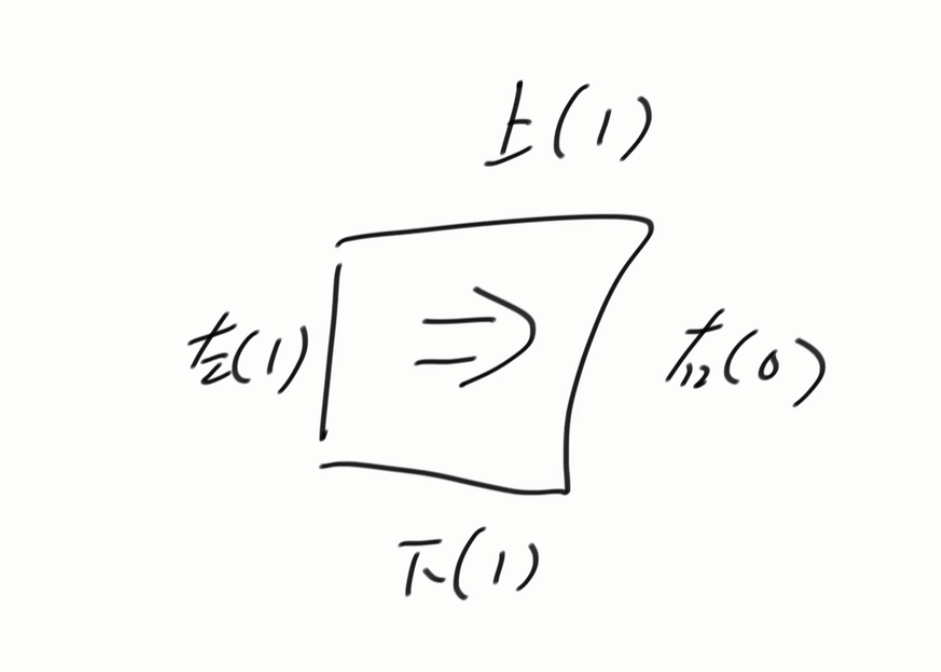

知识点：0-1bfs


[算法讲解062【必备】宽度优先遍历及其扩展_哔哩哔哩_bilibili](https://www.bilibili.com/video/BV1Dw411w7P5/?spm_id_from=333.1391.0.0&vd_source=96c1635797a0d7626fb60e973a29da38)


[1368. 使网格图至少有一条有效路径的最小代价 - 力扣（LeetCode）](https://leetcode.cn/problems/minimum-cost-to-make-at-least-one-valid-path-in-a-grid/)





如上图，这个题目本质就是一个0-1bfs，就像上面这个图的箭头指向，往右是0代价，往其他方向就是1代价。


```java


class Solution {
    public int minCost(int[][] grid) {
        int m = grid.length; // 获取网格的行数
        int n = grid[0].length; // 获取网格的列数

        int[][] distance = new int[m][n];
        // 初始化每个点的距离为无穷大，distance[i][j] 代表从 (0,0) 到 (i,j) 需要修改方向的最小次数
        for (int i = 0; i < m; i++) {
            for (int j = 0; j < n; j++) {
                distance[i][j] = Integer.MAX_VALUE; // 设为无穷大，表示尚未访问
            }
        }
        distance[0][0] = 0; // 起点 (0,0) 需要修改方向的次数为 0

        Deque<int[]> queue = new ArrayDeque<>(); // 双端队列用于 0-1 BFS

        // 为了方便，第一个索引不要，后面的把 dx 和 dy 的顺序也改成右左下上，对应 1,2,3,4
        int[] dx = new int[]{-1, 0, 0, 1, -1};
        int[] dy = new int[]{-1, 1, -1, 0, 0};

        queue.offer(new int[]{0, 0}); // 将起点加入队列

        while (!queue.isEmpty()) {
            int[] cur = queue.poll(); // 取出当前节点
            int x = cur[0];
            int y = cur[1];

            // 如果已经到达终点 (m-1, n-1)，返回最小修改方向的次数
            if (x == m - 1 && y == n - 1) {
                return distance[x][y];
            }

            // 遍历四个方向
            for (int i = 1; i < 5; i++) {
                int nx = x + dx[i]; // 计算新位置的行坐标
                int ny = y + dy[i]; // 计算新位置的列坐标

                // 判断新位置是否在网格范围内
                if (nx >= 0 && nx < m && ny >= 0 && ny < n) {
                    if (grid[x][y] == i) {  // 当前位置指向的方向和下一步要走的方向一致，无代价
                        if (distance[x][y] < distance[nx][ny]) { // 如果新路径的代价更小，则更新
                            distance[nx][ny] = distance[x][y];
                            queue.offerFirst(new int[]{nx, ny}); // 由于没有代价，将其放入队列前端
                        }
                    } else { // 当前位置指向的方向和下一步要走的方向不一致，代价为 1
                        if (distance[x][y] + 1 < distance[nx][ny]) { // 如果新路径代价更小，则更新
                            distance[nx][ny] = distance[x][y] + 1;
                            queue.offerLast(new int[]{nx, ny}); // 由于有代价，将其放入队列后端
                        }
                    }
                }
            }
        }
        return -1; // 如果无法到达终点，则返回 -1（理论上不会发生）
    }
}


```

