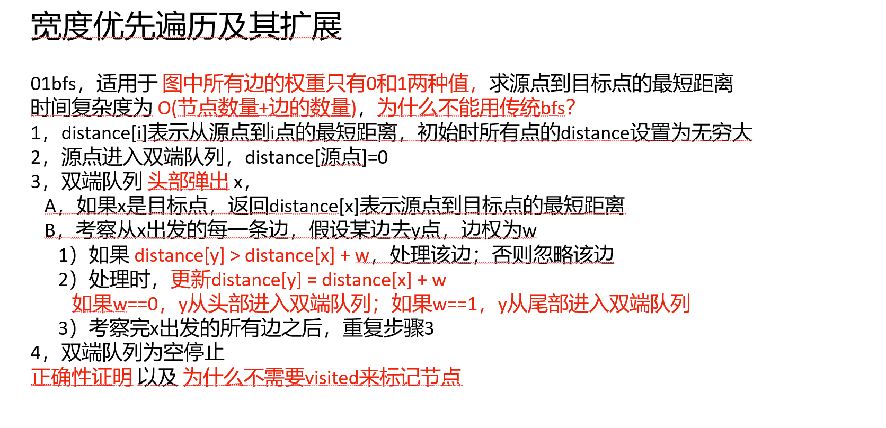

知识点：0-1bfs，几乎就是模板题目





[2290. 到达角落需要移除障碍物的最小数目 - 力扣（LeetCode）](https://leetcode.cn/problems/minimum-obstacle-removal-to-reach-corner/description/)


[算法讲解062【必备】宽度优先遍历及其扩展_哔哩哔哩_bilibili](https://www.bilibili.com/video/BV1Dw411w7P5/?spm_id_from=333.1391.0.0&vd_source=96c1635797a0d7626fb60e973a29da38)


```java
import java.util.ArrayDeque;
import java.util.Deque;

class Solution {
    public int minimumObstacles(int[][] grid) {
        int n = grid.length; // 获取网格的行数
        int m = grid[0].length; // 获取网格的列数

        int[][] distance = new int[n][m];
        // 初始化每个点的距离为无穷大，distance[i][j] 就表示从起点 (0,0) 到 (i,j) 需要移除的最少障碍物数量
        for (int i = 0; i < n; i++) {
            for (int j = 0; j < m; j++) {
                distance[i][j] = Integer.MAX_VALUE; // 设置初始值为无穷大，表示尚未访问
            }
        }

        distance[0][0] = 0; // 起点 (0,0) 需要移除的障碍物数量为 0

        // 定义四个方向的偏移量，分别对应上、右、下、左
        int[] dx = new int[]{-1, 0, 1, 0};
        int[] dy = new int[]{0, 1, 0, -1};

        // 使用双端队列（Deque）进行 0-1 BFS
        Deque<int[]> queue = new ArrayDeque<>();

        // 将起点 (0,0) 加入队列
        queue.add(new int[]{0, 0});

        while (!queue.isEmpty()) {
            // 取出当前处理的坐标
            int[] cur = queue.poll();
            int x = cur[0];
            int y = cur[1];

            // 如果已经到达终点 (n-1, m-1)，返回最小移除障碍物数量
            if (x == n - 1 && y == m - 1) {
                return distance[x][y];
            }

            // 遍历四个方向的相邻格子
            for (int i = 0; i < 4; i++) {
                int nx = x + dx[i]; // 计算新位置的行坐标
                int ny = y + dy[i]; // 计算新位置的列坐标

                // 判断新位置是否在网格范围内
                if (nx >= 0 && nx < n && ny >= 0 && ny < m) {
                    // 计算新位置的距离
                    int newDistance = distance[x][y] + grid[nx][ny];

                    // 如果新的路径所需移除的障碍物数更少，则更新 distance 数组
                    if (newDistance < distance[nx][ny]) {
                        distance[nx][ny] = newDistance;

                        // 根据新位置是否是障碍物选择放入队列的方式
                        if (grid[nx][ny] == 0) {
                            // 如果是空地 (0)，优先加入队列头部，保证先处理
                            queue.offerFirst(new int[]{nx, ny});
                        } else {
                            // 如果是障碍物 (1)，加入队列尾部，稍后处理
                            queue.offerLast(new int[]{nx, ny});
                        }
                    }
                }
            }
        }

        // 如果无法到达终点，返回 -1（理论上不会触发，因为 BFS 只要有路径就一定能找到）
        return -1;
    }
}

```

