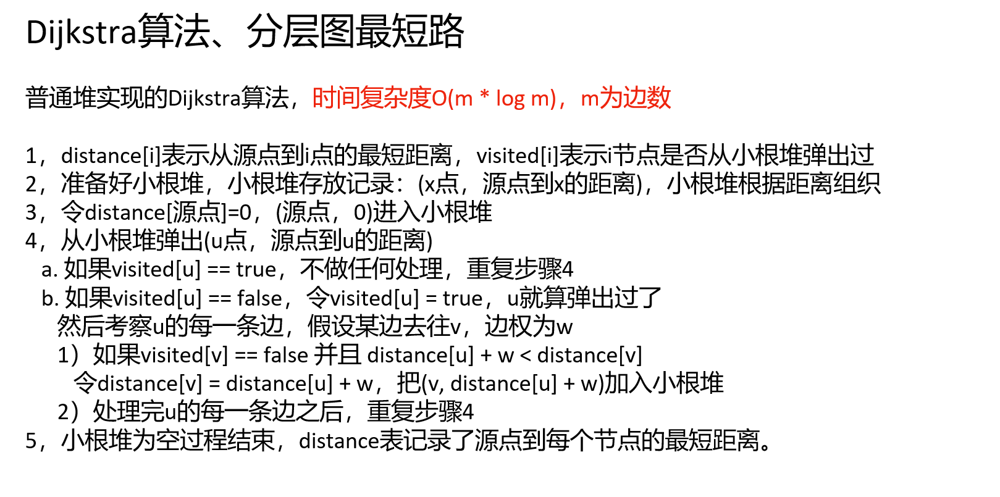

 [算法讲解064【必备】Dijkstra算法、分层图最短路.pptx](..\..\..\..\Java资料\数据结构与算法\zuoGod_algorithm-journey-main\ppt\算法讲解064【必备】Dijkstra算法、分层图最短路.pptx) 


[算法讲解064【必备】Dijkstra算法、分层图最短路_哔哩哔哩_bilibili](https://www.bilibili.com/video/BV1Cm4y1g77W/?spm_id_from=333.1387.upload.video_card.click&vd_source=96c1635797a0d7626fb60e973a29da38)


 [算法讲解064【必备】Dijkstra算法、分层图最短路.pptx](..\..\..\..\Java资料\数据结构与算法\zuoGod_algorithm-journey-main\ppt\算法讲解064【必备】Dijkstra算法、分层图最短路.pptx) 


Dijkstra算法也可以解决无向图问题，因为可以将无向图看作一个有向图


***这里给出一个解释，0-1bfs算是Dijkstra算法的一个特例！！！！！！***


# Dijkstra算法步骤


这张图展示了Dijkstra算法的一个应用示意，以下是算法的详细过程：

1. **图的初始状态：**

   - 图中的节点表示地点（a、b、c、d、e）。
   - 边上的数字表示从一个节点到另一个节点的权重或距离。例如，从a到d的距离为20，从a到b的距离为6。
   - 我们从节点a开始，目标是找到从a到其他所有节点的最短路径。

2. **初始化：**

   - 距离数组（distance）

     ：初始化时，除了起点a的距离为0，其他节点的距离设为无穷大（表示不可达）。

     ```
     distance = [0, ∞, ∞, ∞, ∞]  (分别对应 a, b, c, d, e)
     ```

   - 访问标记数组（visited）

     ：表示哪些节点已经被访问过，开始时只有起点a被访问。（**这里的访问就是只要从小根堆里弹出来了，就算已访问**），且这里的开始时算是第一次从小根堆里弹出a，然后标记a被已访问，因为初始化的时候肯定要先把源点a放入小根堆。

     ```
     
     visited = [V, X, X, X, X]  (V表示访问过，X表示未访问)
     ```

3. **算法过程：**

   - **步骤1**：从起点a开始，选择当前小根堆未访问节点中距离最小的节点。此时起点a的距离为0，所以选择a作为当前节点。（将a从小根堆里弹出）

     - 从a出发，检查所有与a直接相连的节点（b、d、c）。
     - 更新这些节点的距离值。对于节点b，a到b的距离为2，因此更新`distance[b]`为2，且将结果放入小根堆；对于节点c，a到c的距离为6，因此更新`distance[c]`为6，且将结果放入小根堆；对于节点d，a到d的距离为20，因此更新`distance[d]`为20，且将结果放入小根堆。
     - 更新完后，标记a为已访问。

     ```
     distance = [0, 2, 6, 20, ∞]
     visited = [V, X, X, X, X]
     ```

   - **步骤2**：选择小根堆中距离最小的未访问节点。在这时，b的距离为2，是最小的，选择b作为当前节点。（将b从小根堆里弹出）

     - 检查与b直接相连的节点（a、c、e）。a已经被访问过，不需要更新；但从b到c的距离是2+ 1= 3，小于之前的a到c距离6，因此更新`distance[c]`为3，且将结果放入小根堆；对于节点e，b到e的距离为2+100=102，因此更新`distance[d]`为102，且将结果放入小根堆。
     - 更新完后，标记b为已访问。

     ```
     distance = [0, 2, 3, 20,102]
     visited = [V, V, X, X, X]
     ```

   - **步骤3**：选择下一个小根堆中距离最小的未访问节点，c的距离是3，选择c作为当前节点。

     - 检查与c直接相连的节点（b、d、e）。b已经访问过，所以只更新d和e的距离。
     - 从c到d的距离是3 + 2 = 5，比原本的20更小了，因此更新`distance[d]`为5，且将结果放入小根堆；从c到e的距离是3+ 12 = 15，比原本的102更小了，因此更新`distance[e]`为15，且将结果放入小根堆。
     - 更新完后，标记c为已访问。

     ```
     distance = [0, 2, 3, 5,15]
     visited = [V, V, V, X, X]
     ```

   - **步骤4**：选择下一个小根堆中距离最小的未访问节点，d的距离是5，选择d作为当前节点。

     - 检查与d直接相连的节点（c、e）。c已经访问过，所以只更新e。
     - 从d到e的距离是5+ 4 = 9，比原来的15更小了，因此更新`distance[e]`为9，且将结果放入小根堆。
     - 更新完后，标记d为已访问。

     ```
     distance = [0, 2, 3, 5, 9]
     visited = [V, V, V, V, X]
     ```

   - **步骤5**：选择下一个小根堆中距离最小的未访问节点，是c，但是c已经访问过了，跳过。

   - **步骤6**：选择下一个小根堆中距离最小的未访问节点e，它的距离已经是9，更新其为已访问状态。

   - 接下来继续弹出，就都跳过了，因为都已经访问过了。

4. **最终结果：**

   - 所有节点都已被访问，最短路径的距离就是`distance`数组中的值。
   - 从a到其他节点的最短距离分别是：
     - a到b的最短距离是2
     - a到c的最短距离是3
     - a到d的最短距离是5
     - a到e的最短距离是9  

Dijkstra算法的关键是通过不断选择当前未访问节点中距离最小的节点，并更新与之相连的节点的距离，最终得到从起点到所有节点的最短路径。

一些注意的点：这里visited被标记访问了之后，以后这个点再也不处理了，举个例子，源点是a，我们把a的所有边处理完之后，a就被标记为已访问，下一个要处理的点是b，图上可以看出b有一条边指向a，但是我们已经标记a为已访问了，就不再处理这条边了。

上面举了一个例子讲解了算法

下图为总体算法流程




# Dijkstra算法模板题目


## 核心代码模式

[743. 网络延迟时间 - 力扣（LeetCode）](https://leetcode.cn/problems/network-delay-time/description/)


```java
class Solution {
    public int networkDelayTime(int[][] times, int n, int k) {

        // 创建一个图（邻接表），用来存储每个节点的邻居和对应的时间（权重）
        ArrayList<ArrayList<int[]>> graph = new ArrayList<>();

        // visited数组用来标记节点是否已被访问过
        boolean[] visited = new boolean[n + 1];  // 长度为n+1才能保证访问到序号为n的点，因为这个题目序号从1-n，不是0-n-1。

        // distance数组保存从源点k到其他所有节点的最短时间（距离）
        int[] distance = new int[n + 1];  // 源点到每个点的最短距离
        Arrays.fill(distance, Integer.MAX_VALUE);  // 初始化所有距离为最大值（表示不可达）

        // 为每个节点创建一个空的邻接表
        for (int i = 0; i < n + 1; i++) {
            graph.add(new ArrayList<>());
        }

        // 构建图，times数组中每个元素表示一条有向边，其中times[i][0]是起点，times[i][1]是终点，times[i][2]是边的权重
        for (int[] edge : times) {
            graph.get(edge[0]).add(new int[]{edge[1], edge[2]});  // 从edge[0]到edge[1]的时间为edge[2]
        }

        // 使用优先队列（最小堆）来实现Dijkstra算法，按最短时间（距离）优先处理
        PriorityQueue<int[]> queue = new PriorityQueue<>((a, b) -> a[1] - b[1]);
        
        // 源点k的距离初始化为0
        distance[k] = 0;
        
        // 将源点k加入队列
        queue.add(new int[]{k, 0});
        
        // 开始执行Dijkstra算法
        while (!queue.isEmpty()) {
            int[] cur = queue.poll();  // 从队列中取出当前距离最短的节点
            int curNumber = cur[0];    // 当前节点的编号
            int curDistance = cur[1];  // 当前节点的最短时间（从源点到当前节点的最短时间）
            
            // 如果当前节点已经访问过，则跳过
            if (visited[curNumber]) {
                continue;
            }

            // 遍历当前节点的所有邻接节点
            for (int[] next : graph.get(curNumber)) {
                int nextNumber = next[0];  // 邻接节点的编号
                int nextW = next[1];       // 当前节点到邻接节点的时间（权重）
                
                // 如果邻接节点还没有被访问过，并且通过当前节点到达邻接节点的时间更短，则更新该节点的最短时间
                if (!visited[nextNumber] && curDistance + nextW < distance[nextNumber]) {
                    distance[nextNumber] = curDistance + nextW;  // 更新最短时间
                    queue.add(new int[]{nextNumber, distance[nextNumber]});  // 将邻接节点加入队列
                }
            }
            
            // 标记当前节点为已访问
            visited[curNumber] = true;
        }

        // 计算所有节点的最短时间，找出最大值作为答案
        int ans = Integer.MIN_VALUE;  // 初始化最大值为最小整数
        
        // 遍历所有节点的最短时间
        for (int i = 1; i < distance.length; i++) {
            // 如果某个节点不可达（时间仍为最大值），返回-1
            if (distance[i] == Integer.MAX_VALUE) {
                return -1;
            }
            // 更新最大值（即从源点到所有节点的最短时间中的最大值）
            ans = Math.max(ans, distance[i]);
        }
        
        // 返回最大的最短时间（即网络延迟的最大值）
        return ans;
    }
}

```


## ACM模式

[P4779 【模板】单源最短路径（标准版） - 洛谷 | 计算机科学教育新生态](https://www.luogu.com.cn/problem/P4779)


```java
import java.io.*;
import java.util.*;

// 规定数据量的模板
public class Main {

    public static void main(String[] args) throws IOException {
        // 创建BufferedReader来读取输入
        BufferedReader br = new BufferedReader(new InputStreamReader(System.in));
        // 创建StreamTokenizer来方便读取输入中的各个数值
        StreamTokenizer in = new StreamTokenizer(br);
        // 创建PrintWriter来输出结果
        PrintWriter out = new PrintWriter(new OutputStreamWriter(System.out));

        // 读取点的个数n
        in.nextToken();
        int n = (int) in.nval; 
        
        // 读取边的个数m
        in.nextToken();
        int m = (int) in.nval;  
        
        // 读取起始点s
        in.nextToken();
        int s = (int) in.nval;  
        
        // 初始化图，图用邻接表表示，graph[i]表示从点i出发的所有边
        List<List<int[]>> graph = new ArrayList<>();
        // 初始化n+1个空链表，因为点编号是从1到n
        for (int i = 0; i < n + 1; i++) {
            graph.add(new ArrayList<>());
        }

        // 读取每一条边的信息
        for (int i = 0; i < m; i++) {
            in.nextToken();
            int from = (int) in.nval;  // 起点
            in.nextToken();
            int to = (int) in.nval;    // 终点
            in.nextToken();
            int weight = (int) in.nval;  // 边的权重
            // 将边加入到图中
            graph.get(from).add(new int[]{to, weight});
        }

        // 创建visited数组标记节点是否已经访问过
        boolean[] visited = new boolean[n + 1];
        
        // 创建distance数组保存从起点s到每个点的最短距离，初始为最大值
        int[] distance = new int[n + 1];
        Arrays.fill(distance, Integer.MAX_VALUE); // 初始化为一个非常大的数
        distance[s] = 0; // 起点到自身的距离为0

        // 创建优先队列（最小堆），用于选择当前最短距离的点
        PriorityQueue<int[]> queue = new PriorityQueue<>((a, b) -> a[1] - b[1]);
        // 将起点加入队列，起点的距离是0
        queue.add(new int[]{s, 0});

        // 使用Dijkstra算法计算最短路径
        while (!queue.isEmpty()) {
            // 从队列中取出当前距离最小的点
            int[] cur = queue.poll();
            int curNumber = cur[0];  // 当前点
            int curDistance = cur[1];  // 当前点的距离

            // 如果当前点已经访问过，则跳过
            if (visited[curNumber]) {
                continue;
            }

            // 遍历当前点的所有邻接边
            for (int[] next : graph.get(curNumber)) {
                int nextNumber = next[0];  // 邻接点
                int nextWeight = next[1];  // 当前边的权重

                // 如果当前点没有被访问过，并且从起点到邻接点的距离更小
                if (!visited[nextNumber] && curDistance + nextWeight < distance[nextNumber]) {
                    // 更新距离
                    distance[nextNumber] = curDistance + nextWeight;
                    // 将更新后的邻接点加入优先队列
                    queue.add(new int[]{nextNumber, distance[nextNumber]});
                }
            }

            // 标记当前点为已访问
            visited[curNumber] = true;
        }

        // 输出从起点s到每个点的最短距离
        for (int i = 1; i < distance.length; i++) {
            out.print(distance[i] + " ");  // 输出每个点的最短距离
        }
        
        // 刷新输出流并关闭资源
        out.flush();
        out.close();
        br.close();
    }
}

```

