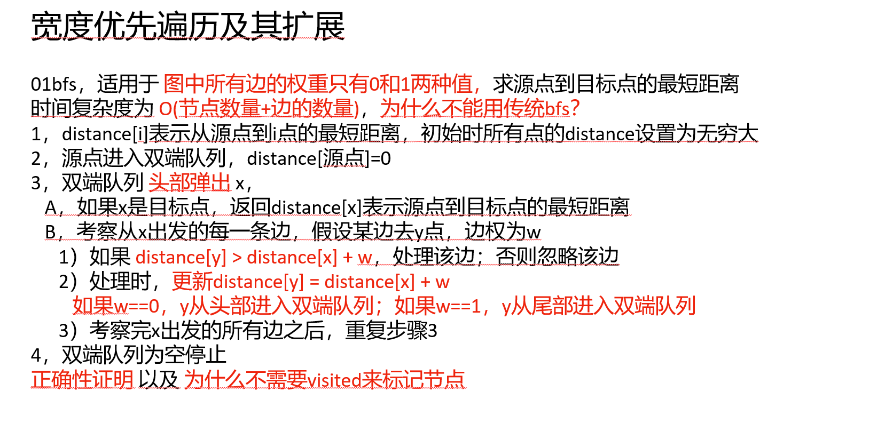

[算法讲解062【必备】宽度优先遍历及其扩展_哔哩哔哩_bilibili](https://www.bilibili.com/video/BV1Dw411w7P5?spm_id_from=333.788.recommend_more_video.-1&vd_source=96c1635797a0d7626fb60e973a29da38)

普通的BFS首先要保证各个路径权值一样才能用，因为最后输出的是level

0-1BFS解决的是路径权值不同，但也仅限于0和1

