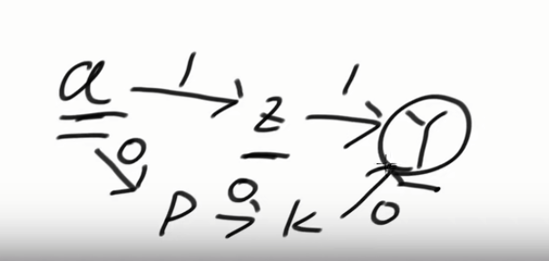

[算法讲解062【必备】宽度优先遍历及其扩展_哔哩哔哩_bilibili](https://www.bilibili.com/video/BV1Dw411w7P5?spm_id_from=333.788.recommend_more_video.-1&vd_source=96c1635797a0d7626fb60e973a29da38)

 [算法讲解062【必备】宽度优先遍历及其扩展.pptx](..\..\..\..\Java资料\数据结构与算法\zuoGod_algorithm-journey-main\ppt\算法讲解062【必备】宽度优先遍历及其扩展.pptx) 

传统的BFS首先要保证各个路径权值一样才能用，因为最后输出的是level

0-1BFS解决的是路径权值不同，但也仅限于0和1

**0-1bfs不需要visited数组来标记访问过的节点**！！！！

# 0-1bfs和传统bfs区别举例

拿上面这个图举例，假如是求a-y的最短距离，如果是传统的bfs，传统的bfs默认路径权值都是一样的，那么最后就会输出最短的距离是2，也就是a-z-y这条由两条边路径。**但是**，这里还有一条路径是a-p-k-y，他虽然是三条边，但是每条边的权值都是0，也就是说走这条路，是没有代价的，所以a-y最短的距离是0。