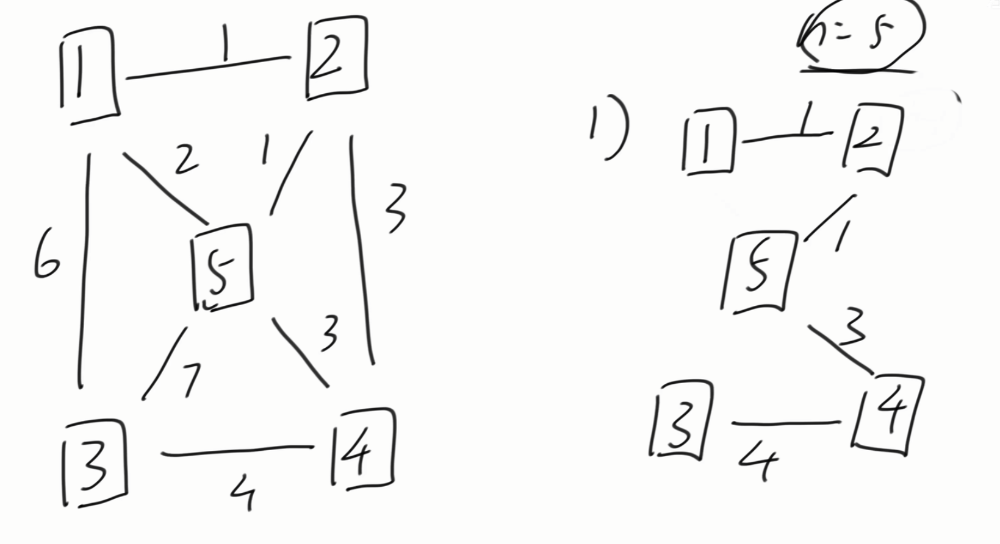
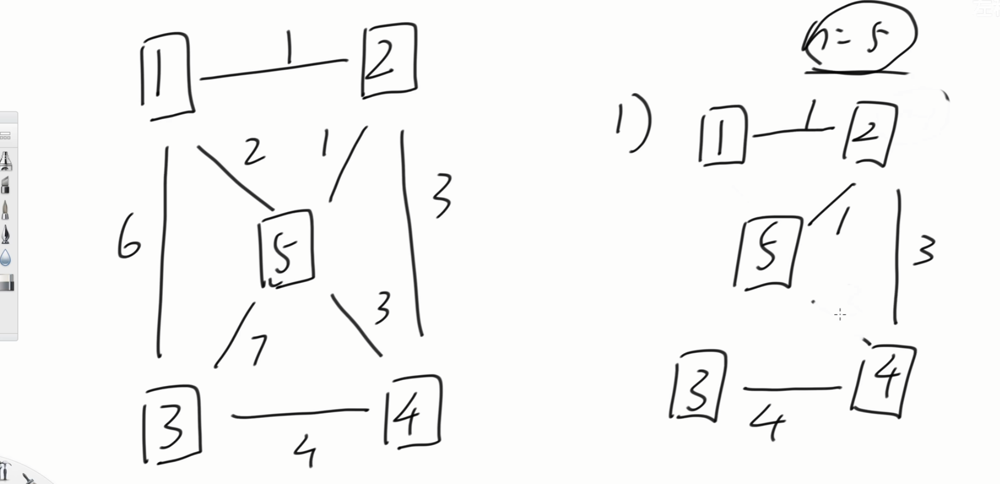

[算法讲解061【必备】最小生成树_哔哩哔哩_bilibili](https://www.bilibili.com/video/BV1sK4y1F7LH/?spm_id_from=333.1387.upload.video_card.click&vd_source=96c1635797a0d7626fb60e973a29da38)


# 最小生成树定义


**最小生成树是所有节点的最小连通子图，即：以最小的成本（边的权值）将图中所有节点链接到一起。**


最小生成树是对于无向带权图来讲的。

**一个图有n个点，至少有n-1条边可以让这个图连通**

如果一个图是无向带权图，有n个点，有n-1条边，则这个图是最小生成树，最小生成树不止一个

**定义：删去多余的边，剩余的n-1条边保证总权值最小**，也就是下图的方案






上面两个方案都是最小生成树


# 最小生成树常用算法


## Kruskal算法（最常用）

1 把所有的边，根据权值从小到大排序，从权值小的边开始考虑

2 如果连接当前的边不会形成环，就选择当前的边（检查会不会成环，就看并查集中连接当前边的两个点是否在一个集合）

3 如果连接当前的边会形成环，就不要当前的边

4 连接够n-1条边之后，最小生成树的也就得到了


Kruskal算法有点类似贪心的思想，**这个算法只要建立并查集，并不需要建图**


## Prim算法（不常用）

1 解锁的点的集合叫set（普通集合）、解锁的边的集合叫heap（小根堆）。set和heap都为空。

2 可从任意点开始，开始点加入到set，开始点的所有边加入到heap

3 从heap中弹出权值最小的边e，查看边e所去往的点x

  A. 如果x已经在set中，边e舍弃，重复步骤3

  B. 如果x不在set中，边e属于最小生成树，把x加入set，重复步骤3

4 当heap为空，最小生成树的也就得到了


# 最小生成树算法模板题目


[P3366 【模板】最小生成树 - 洛谷 | 计算机科学教育新生态](https://www.luogu.com.cn/problem/P3366)


```java
import java.io.*;
import java.util.*;

// 最小生成树模板，使用 Kruskal 算法实现
public class Main {

    public static int maxN = 5010;  // 最大节点数量
    public static int maxM = 200010;  // 最大边的数量
    public static int[][] edges;  // 存储边的数组，每条边包含三个信息：(起点u, 终点v, 权值w)
    public static int[] father;  // 并查集数组，用于快速判断节点是否连通

    // 初始化并查集，将每个节点的父节点初始化为自己
    public static void build(int n) {
        for (int i = 1; i <= n; i++) {
            father[i] = i;
        }
    }

    // 并查集的查找操作，寻找节点 a 的根节点，并路径压缩优化
    public static int find(int a) {
        if (a != father[a]) {  // 如果 a 不是自身的父节点
            father[a] = find(father[a]);  // 路径压缩，直接连接到根节点
        }
        return father[a];  // 返回根节点
    }

    // 并查集的合并操作，将两个集合合并
    public static void union(int a, int b) {
        int fa = find(a);  // 找到 a 的根节点
        int fb = find(b);  // 找到 b 的根节点
        if (fa != fb) {  // 如果两个节点不属于同一个集合
            father[fa] = fb;  // 将 a 的根节点挂到 b 的根节点上
        }
    }

    // 判断两个节点是否属于同一个集合
    public static boolean isSameSet(int a, int b) {
        return find(a) == find(b);
    }

    // 主函数
    public static void main(String[] args) throws IOException {
        BufferedReader br = new BufferedReader(new InputStreamReader(System.in));
        StreamTokenizer in = new StreamTokenizer(br);  // 用于高效读取输入
        PrintWriter out = new PrintWriter(new OutputStreamWriter(System.out));

        edges = new int[maxM][3];  // 定义边的数组，最多包含 maxM 条边
        father = new int[maxN];  // 定义并查集数组，最多包含 maxN 个节点

        // 读取点数和边数
        in.nextToken();
        int n = (int) in.nval;  // n 表示节点数量
        in.nextToken();
        int m = (int) in.nval;  // m 表示边的数量

        build(n);  // 初始化并查集

        // 读取所有边的信息
        for (int i = 0; i < m; i++) {
            in.nextToken();
            edges[i][0] = (int) in.nval;  // 边的起点
            in.nextToken();
            edges[i][1] = (int) in.nval;  // 边的终点
            in.nextToken();
            edges[i][2] = (int) in.nval;  // 边的权值
        }

        // 对边按照权值升序排序，优先选择权值小的边
        Arrays.sort(edges, 0, m, (a, b) -> a[2] - b[2]);

        int count = 0;  // 已处理的边的数量
        int powerSum = 0;  // 最小生成树的总权值

        // 遍历所有边，尝试将它们加入最小生成树
        for (int[] edge : edges) {
            if (!isSameSet(edge[0], edge[1])) {  // 如果当前边的两个端点不属于同一个集合
                union(edge[0], edge[1]);  // 将它们所在的集合合并
                powerSum += edge[2];  // 累加边的权值
                count++;  // 记录已加入的边数

                if (count == n - 1) {  // 如果加入的边数等于 n-1，最小生成树已构造完成
                    break;  // 直接退出循环
                }
            }
        }

        // 输出结果，如果已加入的边数等于 n-1，说明最小生成树构造成功，否则输出 "orz"
        out.println(count == n - 1 ? powerSum : "orz");
        out.flush();  // 刷新输出缓冲区
        out.close();  // 关闭输出流
        br.close();  // 关闭输入流
    }
}

```


**其实这里不退出循环也是可以的，因为最小生成树定义就是对于n个点，要有n-1条边把他们连起来，且权值最小，因为是n-1条边连接n个点，所以一定不成环，假如不提前退出循环，到最后结果也是要么连接出一颗最小生成树，要么找不出n-1条边。**


# 拓展


**最小生成树一定是最小瓶颈树**！！

但是反过来不一定成立


**最小瓶颈树**（Minimum Bottleneck Spanning Tree, MBST）是图论中的一种特殊的生成树。它的核心目标是：**在所有可能的生成树中，找到最大边权值最小的生成树**。

### 核心概念

- **生成树**：一棵连通无向图的子图，它是一个树，包含所有节点且无环。
- **瓶颈边**：在生成树中，权值最大的边称为瓶颈边（Bottleneck Edge）。
- **最小瓶颈树**：在所有生成树中，瓶颈边权值最小的生成树。

### 特性

1. **与最小生成树的关系**：
   - **每棵最小生成树（Minimum Spanning Tree, MST）一定是最小瓶颈树。**
   - **但最小瓶颈树不一定是最小生成树。**
   - 最小瓶颈树可能有多种形式，但它们的瓶颈边权值相同。
2. **最小瓶颈树的判定方法**：
   - 如果生成树的瓶颈边权值等于最小生成树的瓶颈边权值，则这棵生成树是最小瓶颈树。
