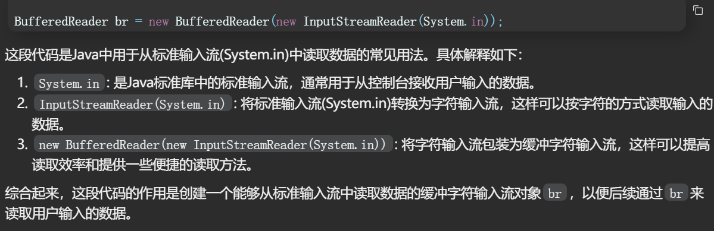
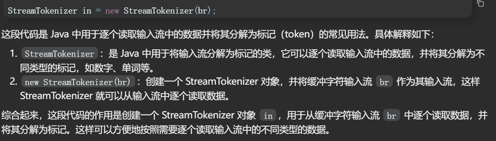
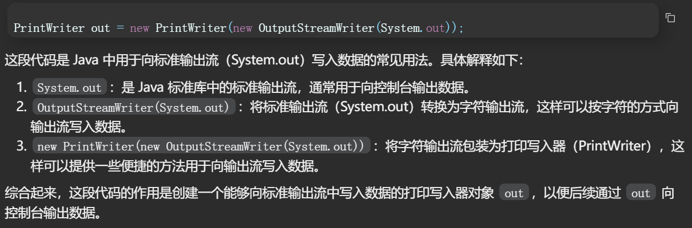
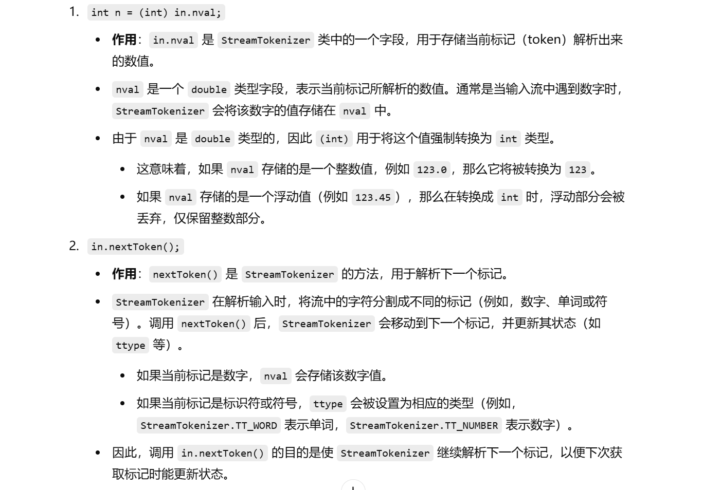

## 利用IO流处理输入输出

### (BufferedReader、StreamTokenizer、PrintWriter)

// 展示acm风格的测试方式

// 子矩阵的最大累加和问题，不要求会解题思路，后面的课会讲

// 每一组测试都给定数据规模

// 需要任何空间都动态生成，在大厂笔试或者比赛中，这种方式并不推荐

// 测试链接 : https://www.nowcoder.com/practice/cb82a97dcd0d48a7b1f4ee917e2c0409?

// 请同学们务必参考如下代码中关于输入、输出的处理

// 这是输入输出处理效率很高的写法

// 提交以下的code，提交时请把类名改成"Main"，可以直接通过


### 使用动态数组的写法，在有的测试平台中会计算你使用的所有空间，不会管你释没释放这个空间

```java
import java.io.BufferedReader;
import java.io.IOException;
import java.io.InputStreamReader;
import java.io.OutputStreamWriter;
import java.io.PrintWriter;
import java.io.StreamTokenizer;

public class Code02_SpecifyAmount{

    // 主函数入口
    public static void main(String[] args) throws IOException {
       // 从标准输入流中读取数据
       BufferedReader br = new BufferedReader(new InputStreamReader(System.in));
       // 创建一个StreamTokenizer用于逐个读取数字
       StreamTokenizer in = new StreamTokenizer(br);
       // 创建一个PrintWriter用于输出结果
       PrintWriter out = new PrintWriter(new OutputStreamWriter(System.out));
       while (in.nextToken() != StreamTokenizer.TT_EOF) { // 当文件没有结束时循环
          // 读取n，表示二维数组的行数
          int n = (int) in.nval;
          in.nextToken();
          // 读取m，表示二维数组的列数
          int m = (int) in.nval;
          // 创建一个二维数组用于存储数字
          int[][] mat = new int[n][m];
          // 逐个读取二维数组中的元素并存储到mat中
          for (int i = 0; i < n; i++) {
             for (int j = 0; j < m; j++) {
                in.nextToken();
                mat[i][j] = (int) in.nval;
             }
          }
          // 调用maxSumSubmatrix方法计算子矩阵的最大累加和，并输出结果
          out.println(maxSumSubmatrix(mat, n, m));
       }
       // 刷新输出流并关闭输入输出流
       out.flush();
       br.close();
       out.close();
    }

    // 计算二维数组中子矩阵的最大累加和
    public static int maxSumSubmatrix(int[][] mat, int n, int m) {
       int max = Integer.MIN_VALUE;  // 初始化最大累加和为整数最小值
       for (int i = 0; i < n; i++) {  // 遍历矩阵的行
          // 需要的辅助数组，临时动态生成
          int[] arr = new int[m];  // 创建一个大小为m的辅助数组
          for (int j = i; j < n; j++) {  // 从当前行开始遍历到最后一行
             for (int k = 0; k < m; k++) {  // 遍历矩阵的列
                arr[k] += mat[j][k];  // 将当前行的元素累加到辅助数组中
             }
             // 调用maxSumSubarray方法计算子数组的最大累加和，并更新最大累加和
             max = Math.max(max, maxSumSubarray(arr, m));
          }
       }
       return max;  // 返回最大累加和
    }

    // 计算数组中子数组的最大累加和
    public static int maxSumSubarray(int[] arr, int m) {
       int max = Integer.MIN_VALUE;  // 初始化最大累加和为整数最小值
       int cur = 0;  // 当前累加和初始化为0
       for (int i = 0; i < m; i++) {  // 遍历数组
          cur += arr[i];  // 将当前元素累加到当前累加和中
          max = Math.max(max, cur);  // 更新最大累加和
          cur = cur < 0 ? 0 : cur;  // 如果当前累加和小于0，则将当前累加和置为0
       }
       return max;  // 返回最大累加和
    }

}
```

### 为什么这么写？为什么这样快？












### 使用静态数组的写法


```java
import java.io.BufferedReader;
import java.io.IOException;
import java.io.InputStreamReader;
import java.io.OutputStreamWriter;
import java.io.PrintWriter;
import java.io.StreamTokenizer;
import java.util.Arrays;

public class Code03_StaticSpace {

    // 题目给定的行的最大数据量
    public static int MAXN = 201;

    // 题目给定的列的最大数据量
    public static int MAXM = 201;

    // 申请这么大的矩阵空间，一定够用了
    // 静态的空间，不停复用
    public static int[][] mat = new int[MAXN][MAXM];

    // 需要的所有辅助空间也提前生成
    // 静态的空间，不停复用
    public static int[] arr = new int[MAXM];

    // 当前测试数据行的数量是n
    // 当前测试数据列的数量是m
    // 这两个变量可以把代码运行的边界规定下来
    public static int n, m;

    public static void main(String[] args) throws IOException {
       BufferedReader br = new BufferedReader(new InputStreamReader(System.in));
       StreamTokenizer in = new StreamTokenizer(br);
       PrintWriter out = new PrintWriter(new OutputStreamWriter(System.out));
       while (in.nextToken() != StreamTokenizer.TT_EOF) {
          n = (int) in.nval;
          in.nextToken();
          m = (int) in.nval;
          for (int i = 0; i < n; i++) {
             for (int j = 0; j < m; j++) {
                in.nextToken();
                mat[i][j] = (int) in.nval;
             }
          }
          out.println(maxSumSubmatrix());
       }
       out.flush();
       br.close();
       out.close();
    }

    // 求子矩阵的最大累加和，后面的课会讲
    public static int maxSumSubmatrix() {
       int max = Integer.MIN_VALUE;
       for (int i = 0; i < n; i++) {
          // 因为之前的过程可能用过辅助数组
          // 为了让之前结果不干扰到这次运行，需要自己清空辅助数组需要用到的部分
          Arrays.fill(arr, 0, m, 0);
          for (int j = i; j < n; j++) {
             for (int k = 0; k < m; k++) {
                arr[k] += mat[j][k];
             }
             max = Math.max(max, maxSumSubarray());
          }
       }
       return max;
    }

    // 求子数组的最大累加和，后面的课会讲
    public static int maxSumSubarray() {
       int max = Integer.MIN_VALUE;
       int cur = 0;
       for (int i = 0; i < m; i++) {
          cur += arr[i];
          max = Math.max(max, cur);
          cur = cur < 0 ? 0 : cur;
       }
       return max;
    }

}
```

