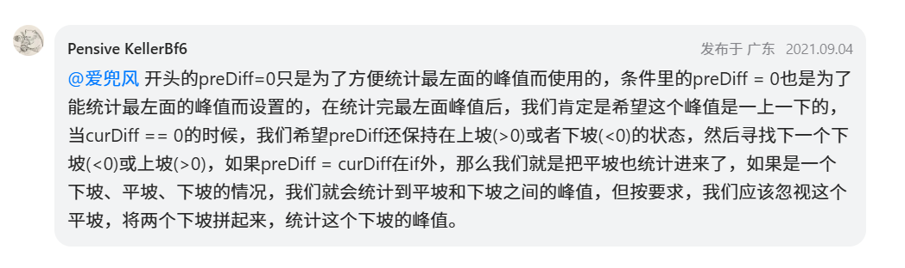

[376. 摆动序列 - 力扣（LeetCode）](https://leetcode.cn/problems/wiggle-subsequence/description/)


# 错误写法

```java
class Solution {
    public int wiggleMaxLength(int[] nums) {
        //一些情况的特殊判断
        if (nums.length == 1) {
            return 1;
        }
        if (nums.length == 2 && nums[0] == nums[1]) {
            return 1;
        }
        if (nums.length == 2 && nums[0] != nums[1]) {
            return 2;
        }

        int count = 0; //记录总长度
        int i = 0;
        while (i < nums.length) {
            if (i == 0 || i == nums.length - 1) {
                count++;
            } else {
                if (nums[i] > nums[i - 1] && nums[i] > nums[i + 1]) {
                    count++;
                } else if (nums[i] < nums[i - 1] && nums[i] < nums[i + 1]) {
                    count++;
                }
            }
            i++;
        }
        return count;
    }
}
```

**对于[0,0,0]这样的序列判定长度为2**，导致错误


# 错误写法2

```java
class Solution {
    public int wiggleMaxLength(int[] nums) {
        //一些情况的特殊判断
        if (nums.length == 1) {
            return 1;
        }
        if (nums.length == 2 && nums[0] == nums[1]) {
            return 1;
        }
        if (nums.length == 2 && nums[0] != nums[1]) {
            return 2;
        }

        int preDiff = 0;  //设置上一个差值
        int curDiff = 0;  //设置当前差值
        int count = 1; //记录总长度，设为1的目的是结果至少是1
        for (int i = 1; i < nums.length; i++) {  //从1开始遍历
            curDiff = nums[i] - nums[i - 1];
            if ((preDiff >= 0 && curDiff < 0) || (preDiff <= 0 && curDiff > 0)) { //=0是初始情况
                count++;
            }
            preDiff = curDiff;
        }
        return count;
    }
}
```


**这里的错误主要是由于preDiff = curDiff;放在了if条件外引起的，拿[1,2,2,3,3,4]这个用例来举例，该程序运行结果是4，但答案是2**

拿[1,2,2,3,3,4]这个例子跑一遍代码流程就懂了



# gpt

```java
class Solution {
    public int wiggleMaxLength(int[] nums) {
        if (nums.length < 2) {
            return nums.length; // 长度小于2的特殊情况
        }

        int count = 1; // 至少有一个元素
        Integer prevDiff = null; // 上一次的差值

        for (int i = 1; i < nums.length; i++) {
            int diff = nums[i] - nums[i - 1];
            if (diff > 0 && (prevDiff == null || prevDiff <= 0)) {
                count++; // 上升摆动
                prevDiff = diff;
            } else if (diff < 0 && (prevDiff == null || prevDiff >= 0)) {
                count++; // 下降摆动
                prevDiff = diff;
            }
        }

        return count;
    }
}

```


```java
class Solution {
    public int wiggleMaxLength(int[] nums) {
        if (nums.length <= 1) {
            return nums.length;
        }
        //当前差值
        int curDiff = 0;
        //上一个差值
        int preDiff = 0;
        int count = 1;
        for (int i = 1; i < nums.length; i++) {
            //得到当前差值
            curDiff = nums[i] - nums[i - 1];
            //如果当前差值和上一个差值为一正一负
            //等于0的情况表示初始时的preDiff
            if ((curDiff > 0 && preDiff <= 0) || (curDiff < 0 && preDiff >= 0)) {
                count++;
                preDiff = curDiff;
            }
        }
        return count;
    }
}
```