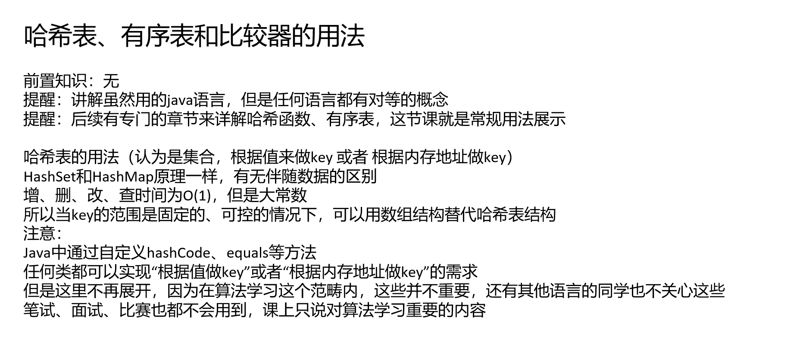

[算法讲解026【必备】哈希表、有序表和比较器的用法_哔哩哔哩_bilibili](https://www.bilibili.com/video/BV13m4y1p7VB/?spm_id_from=333.788.recommend_more_video.-1&vd_source=96c1635797a0d7626fb60e973a29da38)

任何比较器都默认

如果返回负数认为o1的优先级更高

 如果返回正数认为o2的优先级更高

任何比较器都是这样，所以利用这个设定，可以定制优先级怎么确定，也就是怎么比较

不再有大小的概念，就是优先级的概念

### 详情见class026代码