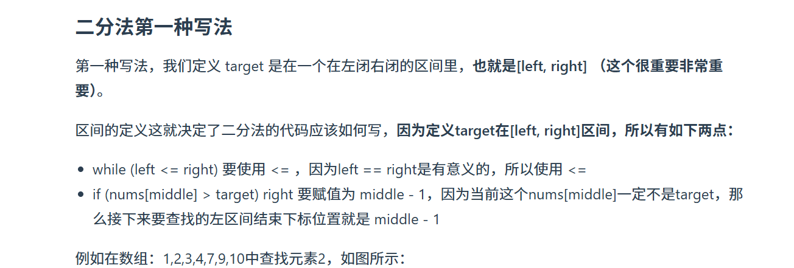
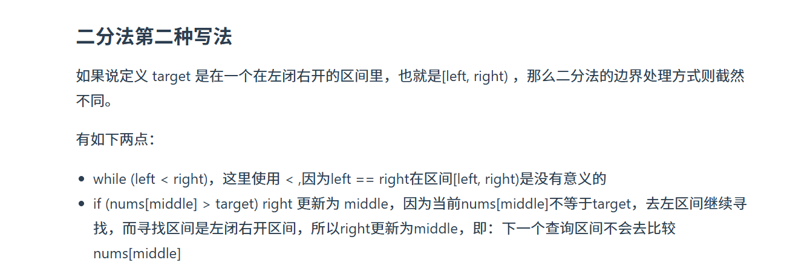

[704. 二分查找 - 力扣（LeetCode）](https://leetcode.cn/problems/binary-search/description/)




## 左闭右闭写法

```java
class Solution {
    public int search(int[] arr, int target) {
        int l = 0, r = arr.length - 1;
        while (l <= r) { 
            int mid = l + (r - l) / 2;
            if (arr[mid] > target) {
                r = mid - 1;
            } else if (arr[mid] < target) {
                l = mid + 1;
            } else {
                return mid;
            }
        }
        return -1;
    }
}
```



