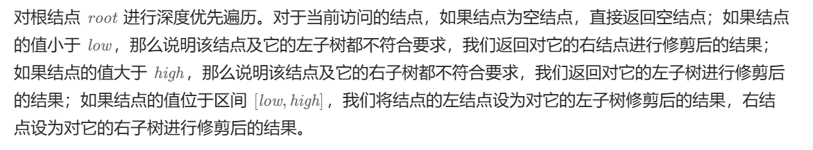

[669. 修剪二叉搜索树 - 力扣（LeetCode）](https://leetcode.cn/problems/trim-a-binary-search-tree/description/)


```java
class Solution {
    public TreeNode trimBST(TreeNode root, int low, int high) {
        if (root == null) {
            return root;
        }
        int cur = root.val;
        if (cur > high) {
            return trimBST(root.left, low, high);
        }
        if (cur < low) {
            return trimBST(root.right, low, high);
        }
        root.left = trimBST(root.left, low, high);
        root.right = trimBST(root.right, low, high);
        return root;
    }
}
```

