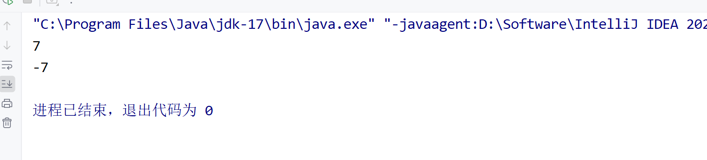

一个字节是8位

int类型占4个字节，32位


补码=反码+1

存储二进制负数时：比如-7，先看+7的原码 0111 ，然后整体取反，1000，然后加一个1，1001，1001即为-7在计算机中的表示
再者，如果有1001，想知道这个数是负几，先整体取反，0110，然后加1，0111，值为7，故为-7.


无论是正数变为负数，还是负数变为正数，都取反+1

```java
public class Test {
    public static void main(String[] args) {
        System.out.println(~(-7)+1);
        System.out.println(~7 + 1);
    }
}
```




