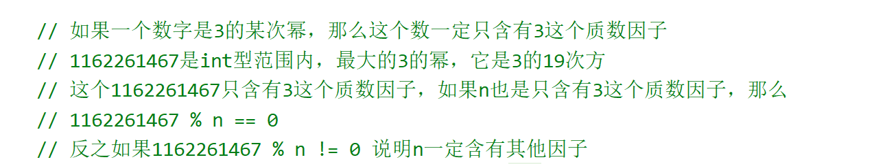

[326. 3 的幂 - 力扣（LeetCode）](https://leetcode.cn/problems/power-of-three/description/)





## 方法1

```java
class Solution {
    public boolean isPowerOfThree(int n) {
       return n > 0 && 1162261467 % n == 0;
    }
}
```


## 方法2

```java
class Solution {
    public boolean isPowerOfThree(int n) {
        while (n > 0 && n % 3 == 0) {
            n /= 3;
        }
        return n == 1;
    }
}
```