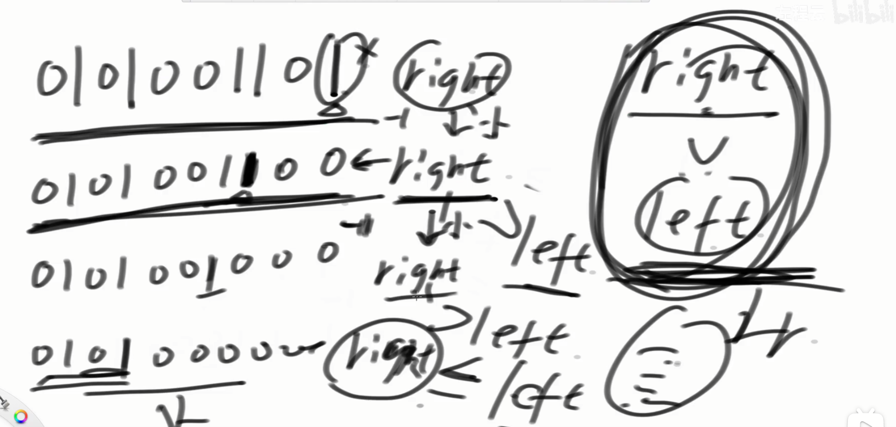

[201. 数字范围按位与 - 力扣（LeetCode）](https://leetcode.cn/problems/bitwise-and-of-numbers-range/description/)




```java
class Solution {
    public int rangeBitwiseAnd(int left, int right) {
        while (left < right) {
            right -= right & (-right);  //每次都减去最右侧的二进制的1
        }
        return right;
    }
}
```

