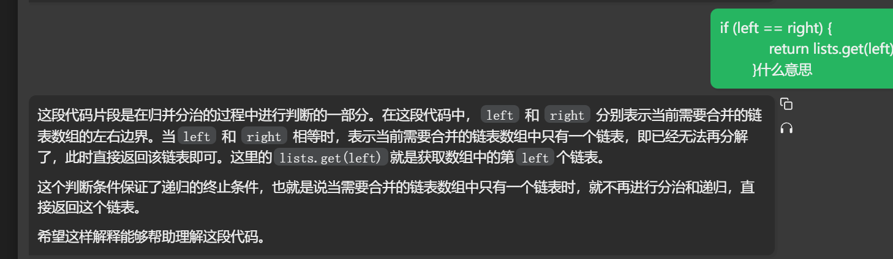

[算法讲解027【必备】堆结构常见题_哔哩哔哩_bilibili](https://www.bilibili.com/video/BV1Gm4y1p7UE/?spm_id_from=333.880.my_history.page.click&vd_source=96c1635797a0d7626fb60e973a29da38)


测试链接：

[合并k个已排序的链表_牛客题霸_牛客网 (nowcoder.com)](https://www.nowcoder.com/practice/65cfde9e5b9b4cf2b6bafa5f3ef33fa6)

[LCR 078. 合并 K 个升序链表 - 力扣（LeetCode）](https://leetcode.cn/problems/vvXgSW/description/)


# 下面的代码以牛客的测试链接为准

## 优先级队列解法（左神）

```java
public class Code01_MergeKSortedLists {

    // 不要提交这个类
    public static class ListNode {
       public int val;
       public ListNode next;
    }

    // 提交以下的方法
    public static ListNode mergeKLists(ArrayList<ListNode> arr) {
       // 创建一个小根堆
       PriorityQueue<ListNode> heap = new PriorityQueue<>((a, b) -> a.val - b.val);  // 使用lambda表达式创建小根堆
       // 将所有链表的头节点加入堆中
       for (ListNode h : arr) {
          if (h != null) {
             heap.add(h);
          }
       }
       // 如果堆为空，直接返回null
       if (heap.isEmpty()) {
          return null;
       }
       // 弹出堆顶节点作为合并后的头节点
       ListNode h = heap.poll();
       // 使用pre指针指向当前节点
       ListNode pre = h;
       // 如果当前节点有下一个节点，将下一个节点加入堆中
       if (pre.next != null) {
          heap.add(pre.next);
       }
       // 循环直到堆为空
       while (!heap.isEmpty()) {
          // 弹出堆顶节点作为当前节点
          ListNode cur = heap.poll();
          // 将当前节点连接到合并后的链表中
          pre.next = cur;
          // 更新pre指针
          pre = cur;
          // 如果当前节点有下一个节点，将下一个节点加入堆中
          if (cur.next != null) {
             heap.add(cur.next);
          }
       }
       // 返回合并后的链表头节点
       return h;
    }

}
```

## 我的写法


## 另一种归并分治的解法

## gpt

```java
import java.util.*;

/*
 * public class ListNode {
 *   int val;
 *   ListNode next = null;
 *   public ListNode(int val) {
 *     this.val = val;
 *   }
 * }
 */

   public class Solution {
        /**
         * 使用归并分治的方法合并 k 个升序链表
         *
         * @param lists ListNode类ArrayList
         * @return 合并后的ListNode类
         */
        public ListNode mergeKLists(ArrayList<ListNode> lists) {
            if (lists == null || lists.size() == 0) {
                return null;
            }
            return merge(lists, 0, lists.size() - 1);
        }

        /**
         * 递归地将链表数组划分成两部分，并合并
         *
         * @param lists 链表数组
         * @param left  左边界
         * @param right 右边界
         * @return 合并后的ListNode类
         */
        private ListNode merge(ArrayList<ListNode> lists, int left, int right) {
            if (left == right) {
                return lists.get(left);
            }
            int mid = left + (right - left) / 2;
            ListNode l1 = merge(lists, left, mid); // 递归合并左半部分
            ListNode l2 = merge(lists, mid + 1, right); // 递归合并右半部分
            return mergeTwoLists(l1, l2); // 合并两部分的结果
        }

        /**
         * 合并两个链表
         *
         * @param l1 链表1
         * @param l2 链表2
         * @return 合并后的ListNode类
         */
        private ListNode mergeTwoLists(ListNode l1, ListNode l2) {
            if (l1 == null) {
                return l2;
            }
            if (l2 == null) {
                return l1;
            }
            ListNode head = new ListNode(0);
            ListNode tail = head, aPtr = l1, bPtr = l2;
            while (aPtr != null && bPtr != null) {
                if (aPtr.val < bPtr.val) {
                    tail.next = aPtr;
                    aPtr = aPtr.next;
                } else {
                    tail.next = bPtr;
                    bPtr = bPtr.next;
                }
                tail = tail.next;
            }
            tail.next = (aPtr != null ? aPtr : bPtr);
            return head.next;
        }
    }
```


