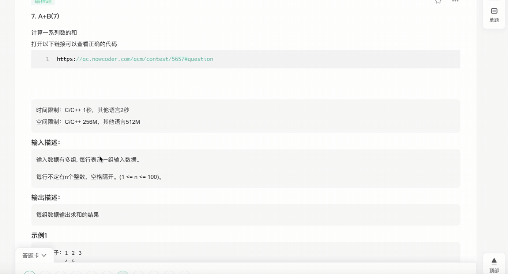
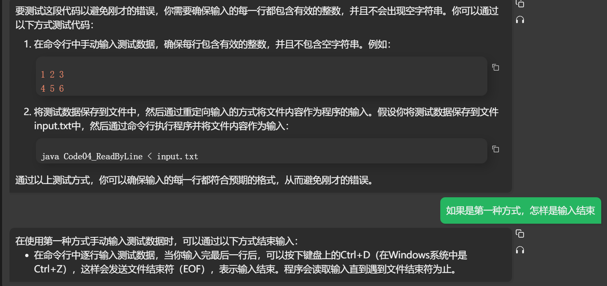

## 利用IO流处理输入输出

### (BufferedReader、PrintWriter)


// 展示acm风格的测试方式、

// 测试链接 : https://www.nowcoder.com/exam/test/70070648/detail?pid=27976983

// 其中，7.A+B(7)，就是一个没有给定数据规模，只能按行读数据的例子

// 此时需要自己切分出数据来计算

// 请同学们务必参考如下代码中关于输入、输出的处理

// 这是输入输出处理效率很高的写法

// 提交以下的code，提交时请把类名改成"Main"，可以直接通过





```java
import java.io.BufferedReader;
import java.io.IOException;
import java.io.InputStreamReader;
import java.io.OutputStreamWriter;
import java.io.PrintWriter;

public class Code04_ReadByLine {

    // 用于存储每行读取的字符串
    public static String line;

    // 用于存储每行按空格分割后的字符串数组
    public static String[] parts;

    // 用于存储每行数字之和
    public static int sum;

    public static void main(String[] args) throws IOException {
        // 创建一个能够按行读取输入流的缓冲字符输入流
        BufferedReader in = new BufferedReader(new InputStreamReader(System.in));
        // 创建一个能够向输出流写入数据的打印写入器
        PrintWriter out = new PrintWriter(new OutputStreamWriter(System.out));

        // 逐行读取输入流中的数据
        while ((line = in.readLine()) != null) {
            // 将每行按空格分割为字符串数组
            parts = line.split(" ");
            // 初始化行数字之和为0
            sum = 0;
            // 遍历每个字符串并将其转换为整数累加到行数字之和中
            for (String num : parts) {
                sum += Integer.valueOf(num);
            }
            // 将行数字之和输出到输出流
            out.println(sum);
        }
        // 刷新输出流并关闭输入输出流
        out.flush();
        in.close();
        out.close();
    }
}
```

在IDEA中测试代码的方式

