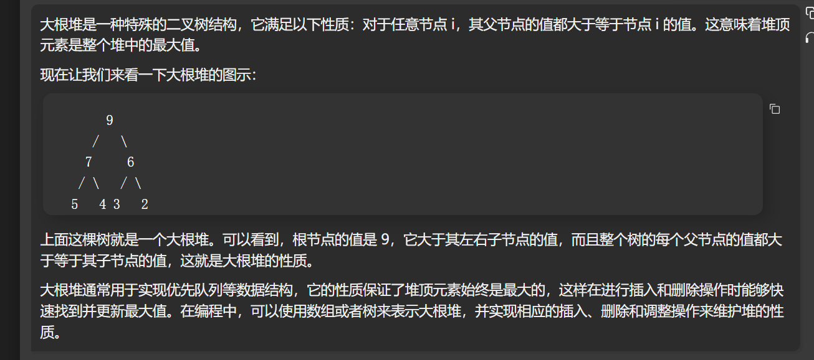
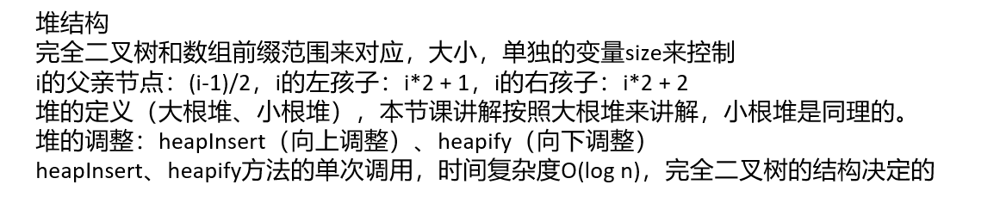

[算法讲解025【必备】堆结构和堆排序_哔哩哔哩_bilibili](https://www.bilibili.com/video/BV1fu4y1q77y/?spm_id_from=333.880.my_history.page.click&vd_source=96c1635797a0d7626fb60e973a29da38)

视频中在最后对从底到顶建堆的时间复杂度分析的很透彻

## 大根堆结构（**小根堆结构与大根堆结构正好相反**）







# acm风格

## 左神写法（加注释） 

```java
public class Code01_HeapSort {

    public static int MAXN = 100001;  // 定义最大数组长度

    public static int[] arr = new int[MAXN];  // 定义数组

    public static int n;  // 定义数组长度

    public static void main(String[] args) throws IOException {
       BufferedReader br = new BufferedReader(new InputStreamReader(System.in));  // 读取输入
       StreamTokenizer in = new StreamTokenizer(br);
       PrintWriter out = new PrintWriter(new OutputStreamWriter(System.out));  // 输出结果
       in.nextToken();
       n = (int) in.nval;  // 读取数组长度
       for (int i = 0; i < n; i++) {  // 读取数组元素
          in.nextToken();
          arr[i] = (int) in.nval;
       }
       // heapSort1();
       heapSort2();  // 调用堆排序方法
       for (int i = 0; i < n - 1; i++) {  // 输出排序后的数组
          out.print(arr[i] + " ");
       }
       out.println(arr[n - 1]);
       out.flush();
       out.close();
       br.close();
    }

    // i位置的数，向上调整大根堆
    public static void heapInsert(int i) {  // 向上调整，使得符合大根堆的性质
       while (arr[i] > arr[(i - 1) / 2]) {
          swap(i, (i - 1) / 2);  // 交换元素
          i = (i - 1) / 2;  // 更新位置
       }
    }

    // i位置的数，向下调整大根堆
    // 当前堆的大小为size
    public static void heapify(int i, int size) {  // 向下调整，使得符合大根堆的性质
       int l = i * 2 + 1;  // 左孩子节点的位置
       while (l < size) {
          int best = l + 1 < size && arr[l + 1] > arr[l] ? l + 1 : l;  // 找到左右孩子中较大的一个
          best = arr[best] > arr[i] ? best : i;  // 找到较大的孩子和父节点中的最大值
          if (best == i) {  // 如果父节点已经是最大值，则退出循环
             break;
          }
          swap(best, i);  // 交换父节点和孩子节点
          i = best;  // 更新位置
          l = i * 2 + 1;  // 更新左孩子节点位置
       }
    }

    public static void swap(int i, int j) {  // 交换数组中两个位置的元素
       int tmp = arr[i];
       arr[i] = arr[j];
       arr[j] = tmp;
    }

    // 从顶到底建立大根堆，O(n * logn)
    // 依次弹出堆内最大值并排好序，O(n * logn)
    // 整体时间复杂度O(n * logn)
    public static void heapSort1() {  // 堆排序方法
       for (int i = 0; i < n; i++) {  // 从顶向下建立大根堆
          heapInsert(i);
       }
       int size = n;
       while (size > 1) {  // 依次弹出堆内最大值并排好序
          swap(0, --size);
          heapify(0, size);
       }
    }

    // 从底到顶建立大根堆，O(n)
    // 依次弹出堆内最大值并排好序，O(n * logn)
    // 整体时间复杂度O(n * logn)
    public static void heapSort2() {  // 堆排序方法
       for (int i = n - 1; i >= 0; i--) {  // 从底向上建立大根堆
          heapify(i, n);
       }
       int size = n;
       while (size > 1) {  // 依次弹出堆内最大值并排好序
          swap(0, --size);
          heapify(0, size);
       }
    }

}
```


## 我的写法

```java
import java.io.*;

public class Code01_test {
    public static int maxl = 100010;
    public static int[] arr = new int[maxl];
    public static int n;

    public static void main(String[] args) throws IOException {
        BufferedReader br = new BufferedReader(new InputStreamReader(System.in));
        StreamTokenizer in = new StreamTokenizer(br);
        PrintWriter out = new PrintWriter(new OutputStreamWriter(System.out));
        in.nextToken();
        n = (int) in.nval;
        for (int i = 0; i < n; i++) {
            in.nextToken();
            arr[i] = (int) in.nval;
        }

        heapsort();
        for (int i = 0; i < n; i++) {
            out.print(arr[i] + " ");
        }
        out.flush();
        out.close();
        br.close();
    }

    public static void swap(int i, int j) {
        int temp = arr[i];
        arr[i] = arr[j];
        arr[j] = temp;
    }

    public static void heapinsert(int i) {
        while (arr[i] > arr[(i - 1) / 2]) {  //这里不能用i-1>>1,因为当i为0时，i-1>>1结果为-1会越界，而(i-1)//2结果为0
            swap(i, (i - 1) / 2);
            i = (i - 1) / 2;
        }
    }

    public static void heappop(int i, int size) {
        int l = i * 2 + 1;
        int best = 0;
        while (l < size) {
            if (l + 1 < size) {
                best = arr[l] > arr[l + 1] ? l : l + 1;
            } else {
                best = l;
            }
            best = arr[i] > arr[best] ? i : best;
            if (best == i) {
                break;
            }
            swap(i, best);
            i = best;
            l = i * 2 + 1;
        }
    }


    public static void heapsort() {
        //从顶到底建堆
        for (int i = 0; i < n; i++) {
            heapinsert(i);
        }
        //从堆中弹出
        int size = n;
        while (size > 1) {
            swap(0, --size); //要先size-1再交换，因为arr的索引最大到size-1，如果先交换再size-1，就会让arr[0]与arr[size]的数交换，而arr[size]的数之前没操作过，默认是0
            heappop(0, size);
        }
    }
}
```


# leetcode风格

```java
class Solution {
    public int[] sortArray(int[] nums) {
        if (nums.length > 1) {
            heapsort(nums);
        }
        return nums;
    }

    public static void heapsort(int[] arr) {
        int size = arr.length;
        for (int i = 0; i < arr.length; i++) {  //如果把这里的for循环放在heapinsert函数里面，leetcode会超时，不知道为何
            heapinsert(arr, i);  //建堆
        }

        while (size > 1) {
            swap(arr, 0, --size);
            heappop(arr, 0, size);
        }
    }

    public static void swap(int[] arr, int i, int j) {
        int temp = arr[i];
        arr[i] = arr[j];
        arr[j] = temp;
    }

    public static void heapinsert(int[] arr, int i) {
        while (arr[i] > arr[(i - 1) / 2]) {
            swap(arr, i, (i - 1) / 2);
            i = (i - 1) / 2;
        }
    }

    public static void heappop(int[] arr, int i, int size) {
        int l = i * 2 + 1;
        int best = 0;
        while (l < size) {
            if (l + 1 < size) {
                best = arr[l] > arr[l + 1] ? l : l + 1;
            } else {
                best = l;
            }
            best = arr[best] > arr[i] ? best : i;
            if (best == i) {
                break;
            }
            swap(arr, i, best);
            i = best;
            l = i * 2 + 1;
        }
    }
}
```

