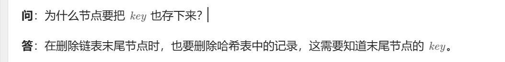

[146. LRU 缓存 - 力扣（LeetCode）](https://leetcode.cn/problems/lru-cache/description/)



## 自己实现(不用哨兵节点)，这段代码多写几遍

```java
class LRUCache {

    public class Node {
        int key;
        int value;
        Node last;
        Node next;

        public Node() {
        }

        public Node(int k, int v) {
            key = k;
            value = v;
        }
    }

    public static Node head, tail;

    public void addtotail(Node node) {  //每添加一个新节点，把它移到链表的最后面，让第一个链表始终是最长时间没操作过的
        if (node == null) {
            return;
        }
        if (head == null) {
            head = node;
            tail = node;
        } else {
            tail.next = node;
            node.last = tail;
            tail = node;
        }

    }

    public void movetotail(Node node) {   //这段代码逻辑有点多
        if (node == tail) {
            return;
        }
        if (node == head) {
            head = node.next;
            node.next.last = null;

        } else {
            node.last.next = node.next;
            node.next.last = node.last;
        }
        node.last = tail;
        node.next = null;
        tail.next = node;
        tail = node;
    }

    public Node removehead() {
        if (head == null) {
            return null;
        }
        Node ans = head;
        if (head == tail) {
            head = null;
            tail = null;
        } else {  //这里不放在else里面会报空指针异常
            head = ans.next;
            ans.next = null;
            head.last = null;
        }
        return ans;
    }

    public static int size;
    public static HashMap<Integer, Node> map;
    public Node node;

    public LRUCache(int capacity) {
        map = new HashMap<>();
        node = new Node();
        size = capacity;
        head = new Node();
        tail = new Node();
        head = null;
        tail = null;
    }

    public int get(int key) {
        if (map.containsKey(key)) {
            int ans = map.get(key).value;
            movetotail(map.get(key));
            return ans;
        } else {
            return -1;
        }
    }

    public void put(int key, int value) {
        if (map.containsKey(key)) {
            Node temp = map.get(key);
            temp.value = value;
            map.put(key, temp);
            movetotail(temp);

        } else {
            if (map.size() == size) {
                Node temp = removehead();
                map.remove(temp.key);
            }
            Node node = new Node(key, value);
            addtotail(node);
            map.put(key, node);
        }
    }
}
```


## 灵茶山艾府做法（用一个哨兵节点）

```java
public class LRUCache {
    private static class Node {
        int key, value;
        Node prev, next;

        Node(int k, int v) {
            key = k;
            value = v;
        }
    }

    private final int capacity;
    private final Node dummy = new Node(0, 0); // 哨兵节点
    private final Map<Integer, Node> keyToNode = new HashMap<>();

    public LRUCache(int capacity) {
        this.capacity = capacity;
        dummy.prev = dummy;
        dummy.next = dummy;
    }

    public int get(int key) {
        Node node = getNode(key);
        return node != null ? node.value : -1;
    }

    public void put(int key, int value) {
        Node node = getNode(key);
        if (node != null) { // 有这本书
            node.value = value; // 更新 value
            return;
        }
        node = new Node(key, value); // 新书
        keyToNode.put(key, node);
        pushFront(node); // 放在最上面
        if (keyToNode.size() > capacity) { // 书太多了
            Node backNode = dummy.prev;
            keyToNode.remove(backNode.key);
            remove(backNode); // 去掉最后一本书
        }
    }

    private Node getNode(int key) {
        if (!keyToNode.containsKey(key)) { // 没有这本书
            return null;
        }
        Node node = keyToNode.get(key); // 有这本书
        remove(node); // 把这本书抽出来
        pushFront(node); // 放在最上面
        return node;
    }

    // 删除一个节点（抽出一本书）
    private void remove(Node x) {
        x.prev.next = x.next;
        x.next.prev = x.prev;
    }

    // 在链表头添加一个节点（把一本书放在最上面）
    private void pushFront(Node x) {
        x.prev = dummy;
        x.next = dummy.next;
        x.prev.next = x;
        x.next.prev = x;
    }
}

```


## 宫水三叶（用两个哨兵节点）

[【设计数据结构】实现一个 LRUCache（手写双向链表入门题） (qq.com)](https://mp.weixin.qq.com/s?__biz=MzU4NDE3MTEyMA==&mid=2247490403&idx=1&sn=dd361a87d74eec4ca9ef97efe016c906)

```java
class LRUCache {
    class Node {
        int k, v;
        Node l, r;
        Node(int _k, int _v) {
            k = _k;
            v = _v;
        }
    }
    int n;
    Node head, tail;
    Map<Integer, Node> map;
    public LRUCache(int capacity) {
        n = capacity;
        map = new HashMap<>();
        head = new Node(-1, -1);
        tail = new Node(-1, -1);
        head.r = tail;
        tail.l = head;
    }
    
    public int get(int key) {
        if (map.containsKey(key)) {
            Node node = map.get(key);
            refresh(node);
            return node.v;
        } 
        return -1;
    }
    
    public void put(int key, int value) {
        Node node = null;
        if (map.containsKey(key)) {
            node = map.get(key);
            node.v = value;
        } else {
            if (map.size() == n) {
                Node del = tail.l;
                map.remove(del.k);
                delete(del);
            }
            node = new Node(key, value);
            map.put(key, node);
        }
        refresh(node);
    }
 
    // refresh 操作分两步：
    // 1. 先将当前节点从双向链表中删除（如果该节点本身存在于双向链表中的话）
    // 2. 将当前节点添加到双向链表头部
    void refresh(Node node) {
        delete(node);
        node.r = head.r;
        node.l = head;
        head.r.l = node;
        head.r = node;
    }
 
    // delete 操作：将当前节点从双向链表中移除
    // 由于我们预先建立 head 和 tail 两位哨兵，因此如果 node.l 不为空，则代表了 node 本身存在于双向链表（不是新节点）
    void delete(Node node) {
        if (node.l != null) {
            Node left = node.l;
            left.r = node.r;
            node.r.l = left;
        }
    }
}
```


## 利用LinkedHashMap实现

#### LinkedHashMap特性

```java
public class Test {
    public static void main(String[] args) {
        LinkedHashMap<Integer, Integer> map=new LinkedHashMap<>(16,0.75f,true);
        map.put(0,1);
        map.put(2,1);
        map.put(3,3);
        System.out.println(map);
        System.out.println();
        map.get(2);
        System.out.println(map);
    }
}
```

LinkedHashMap默认会按照键值对的放入顺序遍历，如上面的代码，16是初始容量，0，75是加载因子，第三个参数当为false时，按默认放入顺序遍历。当为true时，会按照从最远一次到最近一次的键值对进行遍历，也即是LRU结构