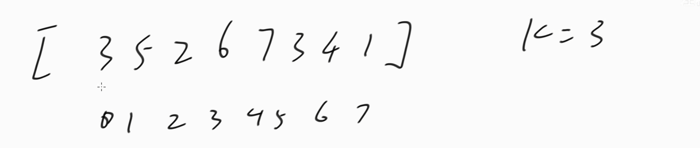
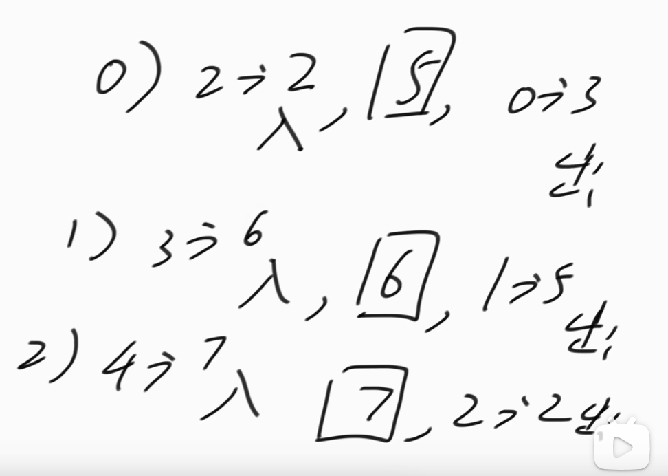

## 单调队列模板题目

[239. 滑动窗口最大值 - 力扣（LeetCode）](https://leetcode.cn/problems/sliding-window-maximum/description/)




先形成一个k-1长度的窗口，也就是用0位置的3和1位置的5形成一个窗口，之后利用这个k-1长度的窗口依次向后滑动，收集答案，=。


然后每进来一个数，就找到k个数中的最大值，并把窗口的头的数弹出，如下图步骤，之后就开始收集答案



第0步，2位置的2进入，得到3 5 2中的最大值5，然后弹出0位置的3

第1步，3位置的6进入，得到5 2 6中的最大值6，然后弹出1位置的5

第2步，4位置的7进入，得到2 6 7中的最大值7，然后弹出2位置的2


注意，双端队列中存储的是数组中的数对应的下标

```java
public class Code01_SlidingWindowMaximum {

	public static int MAXN = 100001;

	public static int[] deque = new int[MAXN];

	public static int h, t;

	public static int[] maxSlidingWindow(int[] arr, int k) {
		h = t = 0;
		int n = arr.length;
		// 先形成长度为k-1的窗口
		for (int i = 0; i < k - 1; i++) {
			// 大 -> 小
            //h < t这个判断条件必须有，判断双端队列是否为空
            //arr[deque[t - 1]] <= arr[i]这句话是维护双端队列严格单调的关键
			while (h < t && arr[deque[t - 1]] <= arr[i]) {
				t--;
			}
			deque[t++] = i;
		}
		int m = n - k + 1;
		int[] ans = new int[m];
		// 当前窗口k-1长度
		for (int l = 0, r = k - 1; l < m; l++, r++) {
			// 少一个，要让r位置的数进来
			while (h < t && arr[deque[t - 1]] <= arr[r]) {
				t--;
			}
			deque[t++] = r;
            
            
			// 收集答案
			ans[l] = arr[deque[h]];  //最大值始终在头部
			// l位置的数出去
			if (deque[h] == l) {   //下一个循环，l就加1了，判断头部对应的下标是否等于即将过期的l下标
                                    //如果等于，说明头部对应的数组下标马上过期了，头部下标也要加1.
				h++;
			}
		}
		return ans;
	}

}
```


