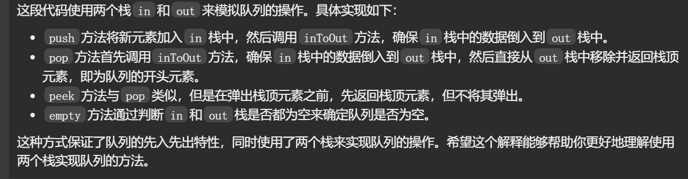
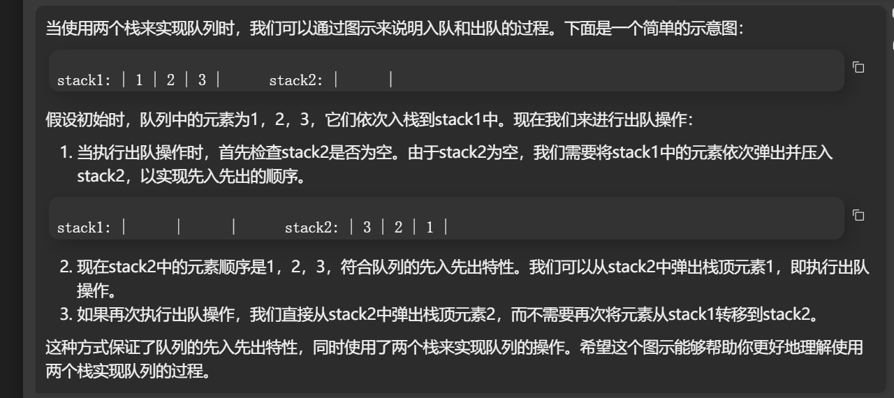
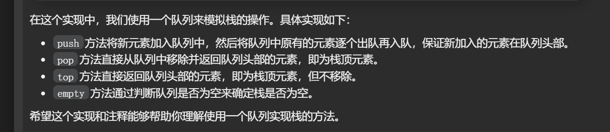
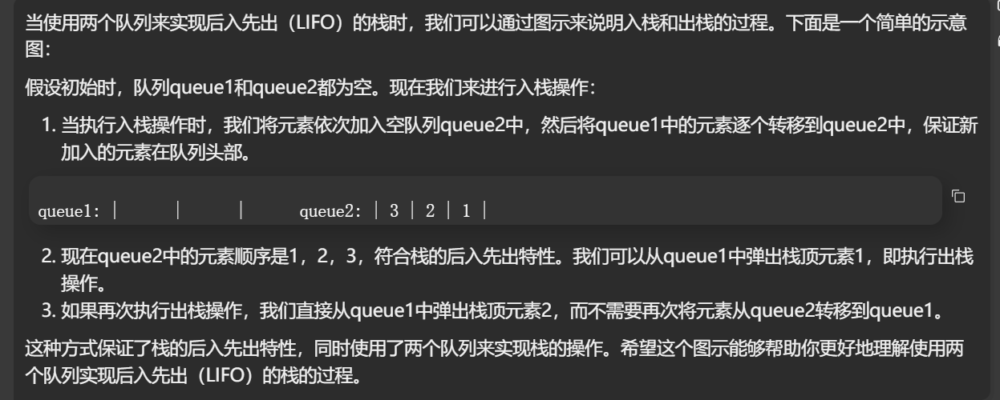

# 栈实现队列

测试链接 : https://leetcode.cn/problems/implement-queue-using-stacks

## 左神

```java
class MyQueue {
    public Stack<Integer> in;  // 用于入队操作的栈
    public Stack<Integer> out;  // 用于出队操作的栈

    public MyQueue() {
       in = new Stack<Integer>();  // 初始化入队栈
       out = new Stack<Integer>();  // 初始化出队栈
    }

    // 将in栈中的数据倒入out栈中
    private void inToOut() {
       if (out.empty()) {  // 如果out栈为空，才需要进行数据倒入操作
          while (!in.empty()) {  // 将in栈中的数据逐个弹出并压入out栈，实现数据倒入
             out.push(in.pop());
          }
       }
    }

    // 将元素 x 推到队列的末尾
    public void push(int x) {
       in.push(x);  // 直接将元素推入in栈
       inToOut();  // 每次入队后都调用inToOut方法，确保数据倒入到out栈中
    }

    // 从队列的开头移除并返回元素
    public int pop() {
       inToOut();  // 每次出队前都调用inToOut方法，确保数据倒入到out栈中
       return out.pop();  // 直接从out栈中移除并返回栈顶元素
    }

    // 返回队列开头的元素
    public int peek() {
       inToOut();  // 每次获取队列开头元素前都调用inToOut方法，确保数据倒入到out栈中
       return out.peek();  // 直接返回out栈的栈顶元素，但不移除
    }

    // 如果队列为空，返回 true；否则，返回 false
    public boolean empty() {
       return in.isEmpty() && out.isEmpty();  // 当in和out栈都为空时，队列为空
    }
}
```



## gpt

```java
class MyQueue {
    private Stack<Integer> stack1;  // 用于入队操作
    private Stack<Integer> stack2;  // 用于出队操作

    public MyQueue() {
       stack1 = new Stack<>();
       stack2 = new Stack<>();
    }

    // 将元素 x 推到队列的末尾
    public void push(int x) {
       stack1.push(x);  // 直接将元素推入 stack1
    }

    // 从队列的开头移除并返回元素
    public int pop() {
       if (stack2.isEmpty()) {  // 如果 stack2 为空，将 stack1 中的元素依次弹出并压入 stack2
          while (!stack1.isEmpty()) {
             stack2.push(stack1.pop());
          }
       }
       return stack2.pop();  // 弹出 stack2 的栈顶元素
    }

    // 返回队列开头的元素
    public int peek() {
       if (stack2.isEmpty()) {  // 如果 stack2 为空，将 stack1 中的元素依次弹出并压入 stack2
          while (!stack1.isEmpty()) {
             stack2.push(stack1.pop());
          }
       }
       return stack2.peek();  // 返回 stack2 的栈顶元素，但不弹出
    }

    // 如果队列为空，返回 true；否则，返回 false
    public boolean empty() {
       return stack1.isEmpty() && stack2.isEmpty();  // 当 stack1 和 stack2 都为空时，队列为空
    }
}
```



## 我

```java
class MyQueue {
    public Stack<Integer> in;
    public Stack<Integer> out;
    public MyQueue() {
       in=new Stack<Integer>();
       out=new Stack<Integer>();
    }

    public void push(int x) {
       in.push(x);
    }

    public int pop() {
       if(out.empty()){
          while(!in.empty()){
             out.push(in.pop());
          }
       }
       return out.pop();
    }

    public int peek() {
       if(out.empty()){
          while(!in.empty()){
             out.push(in.pop());
          }
       }
       return out.peek();
    }

    public boolean empty() {
       if(out.empty()&&in.empty()) return true;
       else return false;
    }
}
```


# 用队列实现栈

测试链接 : https://leetcode.cn/problems/implement-stack-using-queues/

## 左神

```java
class MyStack {
		Queue<Integer> queue;  // 使用一个队列来存储栈中的元素

		public MyStack() {
			queue = new LinkedList<Integer>();  // 初始化队列
		}

		// 将元素 x 压入栈顶
		// 时间复杂度：O(n)
		public void push(int x) {
			int n = queue.size();  // 记录当前队列的大小
			queue.offer(x);  // 将新元素加入队列

			// 将队列中原有的元素逐个出队再入队，保证新加入的元素在队列头部
			for (int i = 0; i < n; i++) {
				queue.offer(queue.poll());
			}
		}

		// 移除并返回栈顶元素
		public int pop() {
			return queue.poll();  // 直接从队列中移除并返回队列头部的元素，即为栈顶元素
		}

		// 返回栈顶元素
		public int top() {
			return queue.peek();  // 直接返回队列头部的元素，即为栈顶元素，但不移除
		}

		// 如果栈是空的，返回 true；否则，返回 false
		public boolean empty() {
			return queue.isEmpty();  // 当队列为空时，栈为空
		}
	}
```



## gpt

```java
class MyStack {
    private Queue<Integer> queue1;  // 用于存储栈中的元素
    private Queue<Integer> queue2;  // 辅助队列

    public MyStack() {
       queue1 = new LinkedList<>();
       queue2 = new LinkedList<>();
    }

    // 将元素 x 压入栈顶
    public void push(int x) {
       queue2.add(x);  // 将新元素加入空队列queue2中
       while (!queue1.isEmpty()) {  // 将queue1中的元素逐个转移到queue2中，保证新加入的元素在队列头部
          queue2.add(queue1.remove());
       }
       Queue<Integer> temp = queue1;  // 交换queue1和queue2，保证queue1始终为非空队列
       queue1 = queue2;
       queue2 = temp;
    }

    // 移除并返回栈顶元素
    public int pop() {
       return queue1.remove();  // 直接从queue1中移除并返回队列头部的元素，即为栈顶元素
    }

    // 返回栈顶元素
    public int top() {
       return queue1.peek();  // 直接返回队列头部的元素，即为栈顶元素，但不移除
    }

    // 如果栈是空的，返回 true；否则，返回 false
    public boolean empty() {
       return queue1.isEmpty();  // 当queue1为空时，栈为空
    }
}
```




## 我（我的代码较为简洁，看我的把）


```java


class MyStack {
		public Queue<Integer> queue;
		public MyStack() {
			queue=new LinkedList<Integer>();
			int size;
		}

		public void push(int x) {
			queue.offer(x);
			for (int i=0;i<queue.size()-1;i++){
				queue.offer(queue.poll());
			}  
		}

		public int pop() {

			return queue.poll();
		}

		public int top() {
			return queue.peek();
		}

		public boolean empty() {
			return queue.isEmpty();
		}
	}
```