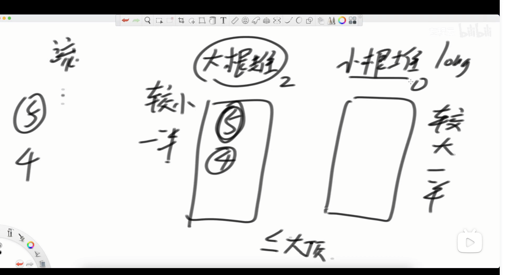
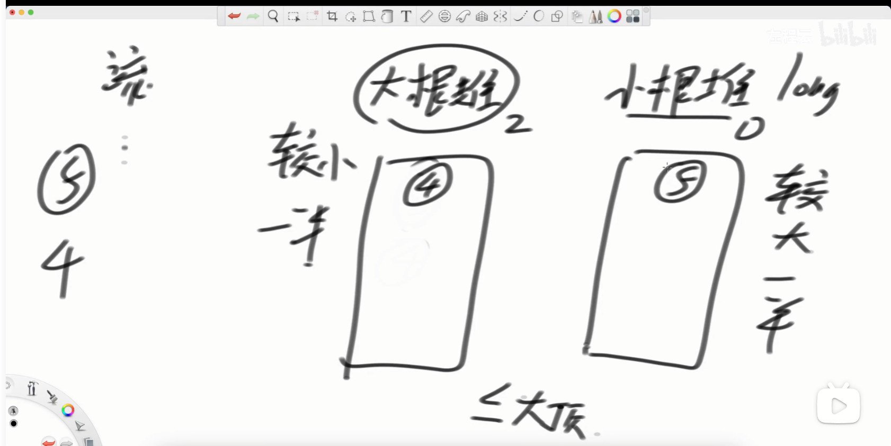

[295. 数据流的中位数 - 力扣（LeetCode）](https://leetcode.cn/problems/find-median-from-data-stream/description/)






```java
class MedianFinder {
    Queue<Integer> heap1;
    Queue<Integer> heap2;

    public MedianFinder() {
        heap1 = new PriorityQueue<>((a, b) -> a - b); //小根堆
        heap2 = new PriorityQueue<>((a, b) -> b - a);  //大根堆

    }

    public void addNum(int num) {
        if (heap1.size() == 0 && heap2.size() == 0) { //判断堆是不是控
            heap2.offer(num);
        } else {
            if (num >= heap2.peek()) {
                heap1.offer(num);
            } else {
                heap2.offer(num);
            }
        }
        if (Math.abs(heap1.size() - heap2.size()) > 1) {  //调整堆，使得两个堆之间的size差不超过1
            if (heap1.size() < heap2.size()) {
                heap1.offer(heap2.poll());
            } else {
                heap2.offer(heap1.poll());
            }
        }
    }

    public double findMedian() {
        int size = heap1.size() + heap2.size();
        double ans;
        if (size % 2 == 0) { //如果两个堆的size和是偶数，说明两个堆的size相等
            ans = (double) (heap1.peek() + heap2.peek()) / 2;
        } else {  //如果是奇数，那么两个堆的size一定会相差1
            if (heap1.size() < heap2.size()) {
                ans = heap2.peek();
            } else {
                ans = heap1.peek();
            }
        }
        return ans;
    }
}
```