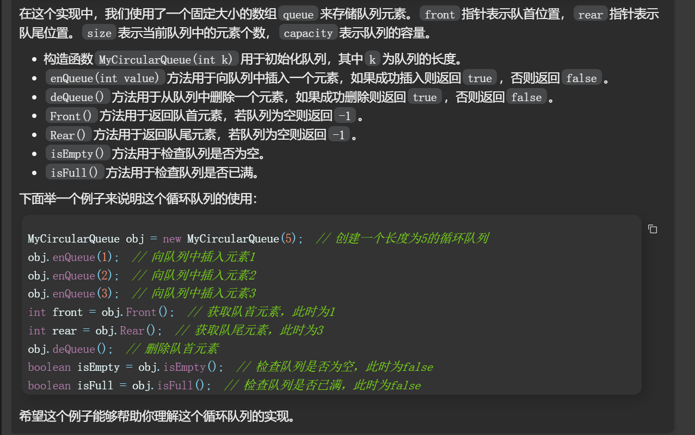

测试链接 : https://leetcode.cn/problems/design-circular-queue/

## gpt

```java
class MyCircularQueue {
    private int[] queue;  // 存储队列元素的数组
    private int front;     // 队首指针
    private int rear;      // 队尾指针
    private int size;      // 当前队列中的元素个数
    private int capacity;  // 队列的容量

    public MyCircularQueue(int k) {  // 构造函数，设置队列长度为 k
       queue = new int[k];
       front = 0;
       rear = -1;
       size = 0;
       capacity = k;
    }

    public boolean enQueue(int value) {  // 向循环队列插入一个元素
       if (!isFull()) {
          rear = (rear + 1) % capacity;  // 计算新的队尾位置
          queue[rear] = value;  // 插入元素
          size++;
          return true;
       } else {
          return false;
       }
    }

    public boolean deQueue() {  // 从循环队列中删除一个元素
       if (!isEmpty()) {
          front = (front + 1) % capacity;  // 计算新的队首位置
          size--;
          return true;
       } else {
          return false;
       }
    }

    public int Front() {  // 从队首获取元素
       if (!isEmpty()) {
          return queue[front];
       } else {
          return -1;
       }
    }

    public int Rear() {  // 获取队尾元素
       if (!isEmpty()) {
          return queue[rear];
       } else {
          return -1;
       }
    }

    public boolean isEmpty() {  // 检查循环队列是否为空
       return size == 0;
    }

    public boolean isFull() {  // 检查循环队列是否已满
       return size == capacity;
    }
}
```




## 我的做法

```java
class MyCircularQueue {
    int capcity;
    int size;
    int head;
    int tail;
    public int[] arr;
    public MyCircularQueue(int k) {
       capcity=k;
       arr=new int[capcity];
       size=0;
       head=0;
       tail=0;
    }

    public boolean enQueue(int value) {
       if(isFull()) return false;
       else{
          arr[tail]=value;
          if(tail==capcity-1) tail=0;
          else tail++;
          size++;
          return true;
       }
    }

    public boolean deQueue() {
       if(isEmpty()) return false;
       else{
          arr[head]=0;
          if(head==capcity-1) head=0;
          else head++;
          size--;
          return true;
       }
    }

    public int Front() {
       if(isEmpty()) return -1;
       else{
          return arr[head];
       }
    }

    public int Rear() {
       if(isEmpty()) return -1;
       else{
          if(tail==0) return arr[capcity-1];
          else return arr[tail-1];
       }
    }

    public boolean isEmpty() {
       return size==0;
    }

    public boolean isFull() {
       return size==capcity;
    }
}
```