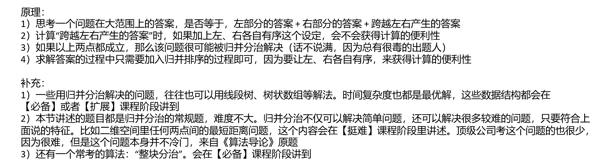

[算法讲解022【必备】归并分治_哔哩哔哩_bilibili](https://www.bilibili.com/video/BV1L14y1B7ef/?spm_id_from=333.788.recommend_more_video.-1&vd_source=96c1635797a0d7626fb60e973a29da38)



### 测试链接

[计算数组的小和_牛客题霸_牛客网 (nowcoder.com)](https://www.nowcoder.com/practice/edfe05a1d45c4ea89101d936cac32469)

### 暴力算法（时间复杂度O(n^2)，测试用例未全部通过，时间复杂度不过关超时了）

```java
import java.io.*;
import java.util.Scanner;

public class Code01_test {
    public static int n;
    public static int max = 100010;
    public static int[] arr = new int[max];
    public static long ans;

    public static void main(String[] args) throws IOException {
        BufferedReader br = new BufferedReader(new InputStreamReader(System.in));
        StreamTokenizer in = new StreamTokenizer(br);
        PrintWriter out = new PrintWriter(new OutputStreamWriter(System.out));
        while (in.nextToken() != StreamTokenizer.TT_EOF) {
            n = (int) in.nval;
            for (int i = 0; i < n; i++) {
                in.nextToken();
                arr[i] = (int) in.nval;
            }
        }
        for (int i = 0; i < n; i++) {
            for (int j = 0; j < i; j++) {
                if (arr[j] <= arr[i]) {
                    ans += arr[j];
                }
            }
        }
        out.println(ans);
        out.flush();
        out.close();
        br.close();
    }
}
```

### 归并分治（左神写法）

```java
// 小和问题
// 测试链接 : https://www.nowcoder.com/practice/edfe05a1d45c4ea89101d936cac32469
// 请同学们务必参考如下代码中关于输入、输出的处理
// 这是输入输出处理效率很高的写法
// 提交以下的code，提交时请把类名改成"Main"，可以直接通过

import java.io.BufferedReader;
import java.io.IOException;
import java.io.InputStreamReader;
import java.io.OutputStreamWriter;
import java.io.PrintWriter;
import java.io.StreamTokenizer;

public class Code01_SmallSum {

    public static int MAXN = 100001;

    public static int[] arr = new int[MAXN];

    public static int[] help = new int[MAXN];

    public static int n;

    public static void main(String[] args) throws IOException {
       BufferedReader br = new BufferedReader(new InputStreamReader(System.in));
       StreamTokenizer in = new StreamTokenizer(br);
       PrintWriter out = new PrintWriter(new OutputStreamWriter(System.out));
       while (in.nextToken() != StreamTokenizer.TT_EOF) {
          n = (int) in.nval;
          for (int i = 0; i < n; i++) {
             in.nextToken();
             arr[i] = (int) in.nval;
          }
          out.println(smallSum(0, n - 1));
       }
       out.flush();
       out.close();
    }

    // 结果比较大，用int会溢出的，所以返回long类型
    // 特别注意溢出这个点，笔试常见坑
    // 返回arr[l...r]范围上，小和的累加和，同时请把arr[l..r]变有序
    // 时间复杂度O(n * logn)
    public static long smallSum(int l, int r) {
       if (l == r) {
          return 0;
       }
       int m = (l + r) / 2;
       return smallSum(l, m) + smallSum(m + 1, r) + merge(l, m, r);
    }

    // 返回跨左右产生的小和累加和，左侧有序、右侧有序，让左右两侧整体有序
    // arr[l...m] arr[m+1...r]
    public static long merge(int l, int m, int r) {
       // 统计部分
       long ans = 0;
       for (int j = m + 1, i = l, sum = 0; j <= r; j++) {
          while (i <= m && arr[i] <= arr[j]) {
             sum += arr[i++];
          }
          ans += sum;
       }
       // 正常merge
       int i = l;
       int a = l;
       int b = m + 1;
       while (a <= m && b <= r) {
          help[i++] = arr[a] <= arr[b] ? arr[a++] : arr[b++];
       }
       while (a <= m) {
          help[i++] = arr[a++];
       }
       while (b <= r) {
          help[i++] = arr[b++];
       }
       for (i = l; i <= r; i++) {
          arr[i] = help[i];
       }
       return ans;
    }

}
```

### 归并分治（我的写法）

```java
import java.io.*;
import java.util.Scanner;

public class Code01_test {
    public static int n;
    public static int max = 100010;
    public static int[] arr = new int[max];
    public static int[] help = new int[max];
    public static long ans;

    public static void main(String[] args) throws IOException {
        BufferedReader br = new BufferedReader(new InputStreamReader(System.in));
        StreamTokenizer in = new StreamTokenizer(br);
        PrintWriter out = new PrintWriter(new OutputStreamWriter(System.out));
        while (in.nextToken() != StreamTokenizer.TT_EOF) {
            n = (int) in.nval;
            for (int i = 0; i < n; i++) {
                in.nextToken();
                arr[i] = (int) in.nval;
            }
        }
        ans = smallsum(0, n - 1);
        out.println(ans);
        out.flush();
        out.close();
        br.close();
    }

    public static long smallsum(int l, int r) {
        if (l == r) return 0;
        int m = l + r >> 1;
        return smallsum(l, m) + smallsum(m + 1, r) + merge(l, m, r);
    }

    public static long merge(int l, int m, int r) {
        long ans = 0, sum = 0;
        for (int a = l, b = m + 1; b <= r; b++) {
            while (a <= m && arr[a] <= arr[b]) {
                sum += arr[a++];
            }
            ans += sum;
        }
        int a = l;
        int b = m + 1;
        int i = l;
        while (a <= m && b <= r) {
            help[i++] = arr[a] <= arr[b] ? arr[a++] : arr[b++];
        }
        while (a <= m) {
            help[i++] = arr[a++];
        }
        while (b <= r) {
            help[i++] = arr[b++];
        }
        for (i = l; i <= r; i++) {
            arr[i] = help[i];
        }
        return ans;
    }
}
```


### 测试链接

[493. 翻转对 - 力扣（LeetCode）](https://leetcode.cn/problems/reverse-pairs/description/)


## 我的写法（该写法通过了测试样例，但超时了）

```java
class Solution {
    public static int Max = 50010;
    public static int[] help = new int[Max];

    public int reversePairs(int[] nums) {
        if (nums.length > 1) {
            return (reverse(nums, 0, nums.length - 1));
        }
        return 0;
    }

    public static int reverse(int[] arr, int l, int r) {
        if (l == r) return 0;
        int m = l + r >> 1;
        return reverse(arr, l, m) + reverse(arr, m + 1, r) + merge(arr, l, m, r);
    }

    public static int merge(int[] arr, int l, int m, int r) {
        int ans = 0, sum = 0;
        for (int a = l, b = m + 1; a <= m; a++) {
            while (b <= r && (long) arr[a] > (long) arr[b] * 2) {
                sum++;
                b++;
            }
            ans += sum;
            b = m + 1; //应该是这里指针的移动导致了超时，要尽量不让指针回退
            sum = 0;
        }
        int a = l;
        int b = m + 1;
        int i = l;
        while (a <= m && b <= r) {
            help[i++] = arr[a] <= arr[b] ? arr[a++] : arr[b++];
        }
        while (a <= m) {
            help[i++] = arr[a++];
        }
        while (b <= r) {
            help[i++] = arr[b++];
        }
        for (i = l; i <= r; i++) {
            arr[i] = help[i];
        }
        return ans;
    }
}
```


## 不超时的写法

```java
class Solution {
    public static int Max = 50010;
    public static int[] help = new int[Max];

    public int reversePairs(int[] nums) {
        if (nums.length > 1) {
            return (reverse(nums, 0, nums.length - 1));
        }
        return 0;
    }

    public static int reverse(int[] arr, int l, int r) {
        if (l == r) return 0;
        int m = l + r >> 1;
        return reverse(arr, l, m) + reverse(arr, m + 1, r) + merge(arr, l, m, r);
    }

    public static int merge(int[] arr, int l, int m, int r) {
        int ans = 0;
        for (int a = l, b = m + 1; a <= m; a++) {
            while (b <= r && (long) arr[a] > (long) arr[b] * 2) {
                b++;  //这里就避免了指针的回退
            }
            ans += b - m - 1;
        }
        int a = l;
        int b = m + 1;
        int i = l;
        while (a <= m && b <= r) {
            help[i++] = arr[a] <= arr[b] ? arr[a++] : arr[b++];
        }
        while (a <= m) {
            help[i++] = arr[a++];
        }
        while (b <= r) {
            help[i++] = arr[b++];
        }
        for (i = l; i <= r; i++) {
            arr[i] = help[i];
        }
        return ans;
    }
}
```


### 测试链接

[LCR 078. 合并 K 个升序链表 - 力扣（LeetCode）](https://leetcode.cn/problems/vvXgSW/description/)