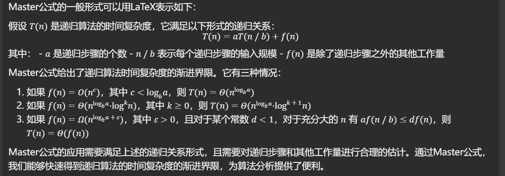
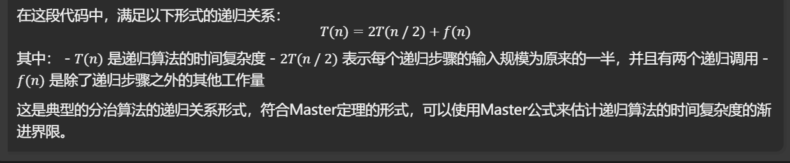
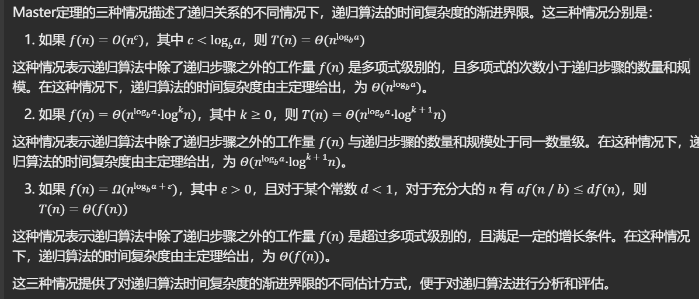
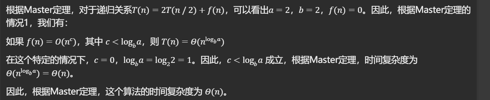
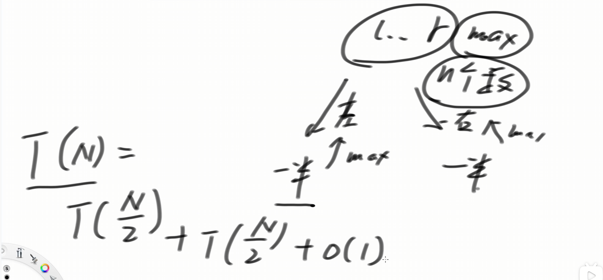
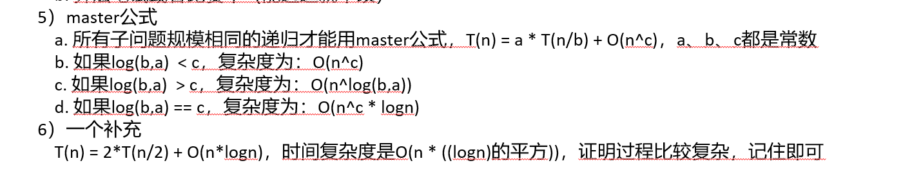

## 递归在底层是利用系统栈来实现的

[算法讲解020【必备】递归和master公式_哔哩哔哩_bilibili](https://www.bilibili.com/video/BV1kV411G7wP/?spm_id_from=333.788.recommend_more_video.-1&vd_source=96c1635797a0d7626fb60e973a29da38)

```java
// 用这个例子讲解递归如何执行
public class GetMaxValue {

    public static int maxValue(int[] arr) {
       return f(arr, 0, arr.length - 1);
    }

    // arr[l....r]范围上的最大值
    public static int f(int[] arr, int l, int r) {
       if (l == r) {
          return arr[l];
       }
       int m = (l + r) / 2;
       int lmax = f(arr, l, m);
       int rmax = f(arr, m + 1, r);
       return Math.max(lmax, rmax);
    }

    public static void main(String[] args) {
       int[] arr = { 3, 8, 7, 6, 4, 5, 1, 2 };
       System.out.println("数组最大值 : " + maxValue(arr));
    }
}
```


## 所有的递归都可以改成非递归

因为递归在系统中是利用系统栈执行的，所以可以自己模拟一个栈来实现。二叉树的先序中序后序就可以写成非递归


## master公式



上面代码的递归关系：











