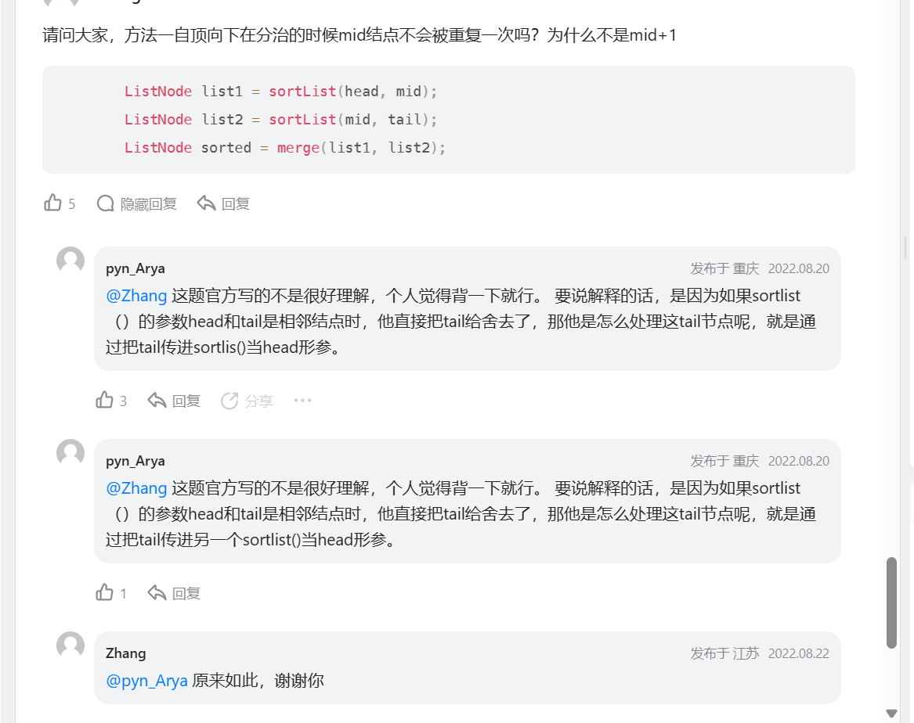
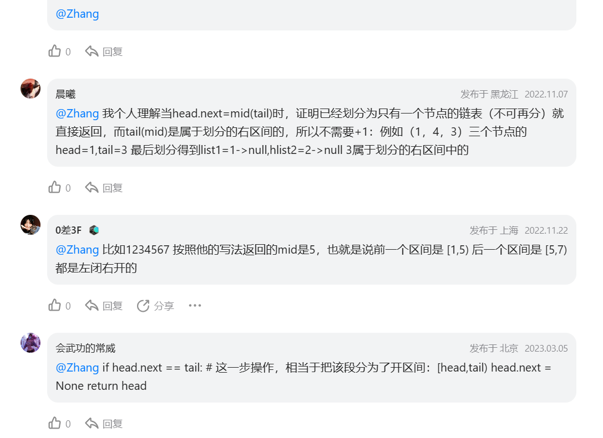

[148. 排序链表 - 力扣（LeetCode）](https://leetcode.cn/problems/sort-list/description/)


## gpt

```java
    class Solution {
        public ListNode sortList(ListNode head) {
            if (head == null || head.next == null) return head;
            return merge_sort(head, null);
        }

        public ListNode merge_sort(ListNode head, ListNode tail) {
            if (head == null || head.next == tail) {
                head.next = null;
                return head;
            }
            ListNode fast = head;
            ListNode slow = head;
            while (fast != tail && fast.next != tail) {
                fast = fast.next.next;
                slow = slow.next;
            }
            ListNode mid = slow;
            ListNode left = merge_sort(head, mid);
            ListNode right = merge_sort(mid, tail);
            return merge(left, right);
        }

        public ListNode merge(ListNode head1, ListNode head2) {
            ListNode dummy = new ListNode(0);
            ListNode cur = dummy;
            while (head1 != null && head2 != null) {
                if (head1.val < head2.val) {
                    cur.next = head1;
                    head1 = head1.next;
                } else {
                    cur.next = head2;
                    head2 = head2.next;
                }
                cur = cur.next;
            }
            if (head1 != null) {
                cur.next = head1;
            } else {
                cur.next = head2;
            }
            return dummy.next;
        }
    }
```






## 左神做法（额外空间复杂度为1）

```java
class Solution {
	// 提交如下的方法
	// 时间复杂度O(n*logn)，额外空间复杂度O(1)，有稳定性
	// 注意为了额外空间复杂度O(1)，所以不能使用递归
	// 因为mergeSort递归需要O(log n)的额外空间
	public static ListNode sortList(ListNode head) {
		int n = 0;
		ListNode cur = head;
		while (cur != null) {
			n++;
			cur = cur.next;
		}
		// l1...r1 每组的左部分
		// l2...r2 每组的右部分
		// next 下一组的开头
		// lastTeamEnd 上一组的结尾
		ListNode l1, r1, l2, r2, next, lastTeamEnd;
		for (int step = 1; step < n; step <<= 1) {
			// 第一组很特殊，因为要决定整个链表的头，所以单独处理
			l1 = head;
			r1 = findEnd(l1, step);
			l2 = r1.next;
			r2 = findEnd(l2, step);
			next = r2.next;
			r1.next = null;
			r2.next = null;
			merge(l1, r1, l2, r2);
			head = start;
			lastTeamEnd = end;
			while (next != null) {
				l1 = next;
				r1 = findEnd(l1, step);
				l2 = r1.next;
				if (l2 == null) {
					lastTeamEnd.next = l1;
					break;
				}
				r2 = findEnd(l2, step);
				next = r2.next;
				r1.next = null;
				r2.next = null;
				merge(l1, r1, l2, r2);
				lastTeamEnd.next = start;
				lastTeamEnd = end;
			}
		}
		return head;
	}

	// 包括s在内，往下数k个节点返回
	// 如果不够，返回最后一个数到的非空节点
	public static ListNode findEnd(ListNode s, int k) {
		while (s.next != null && --k != 0) {
			s = s.next;
		}
		return s;
	}

	public static ListNode start;

	public static ListNode end;

	// l1...r1 -> null : 有序的左部分
	// l2...r2 -> null : 有序的右部分
	// 整体merge在一起，保证有序
	// 并且把全局变量start设置为整体的头，全局变量end设置为整体的尾
	public static void merge(ListNode l1, ListNode r1, ListNode l2, ListNode r2) {
		ListNode pre;
		if (l1.val <= l2.val) {
			start = l1;
			pre = l1;
			l1 = l1.next;
		} else {
			start = l2;
			pre = l2;
			l2 = l2.next;
		}
		while (l1 != null && l2 != null) {
			if (l1.val <= l2.val) {
				pre.next = l1;
				pre = l1;
				l1 = l1.next;
			} else {
				pre.next = l2;
				pre = l2;
				l2 = l2.next;
			}
		}
		if (l1 != null) {
			pre.next = l1;
			end = r1;
		} else {
			pre.next = l2;
			end = r2;
		}
	}
}
```

