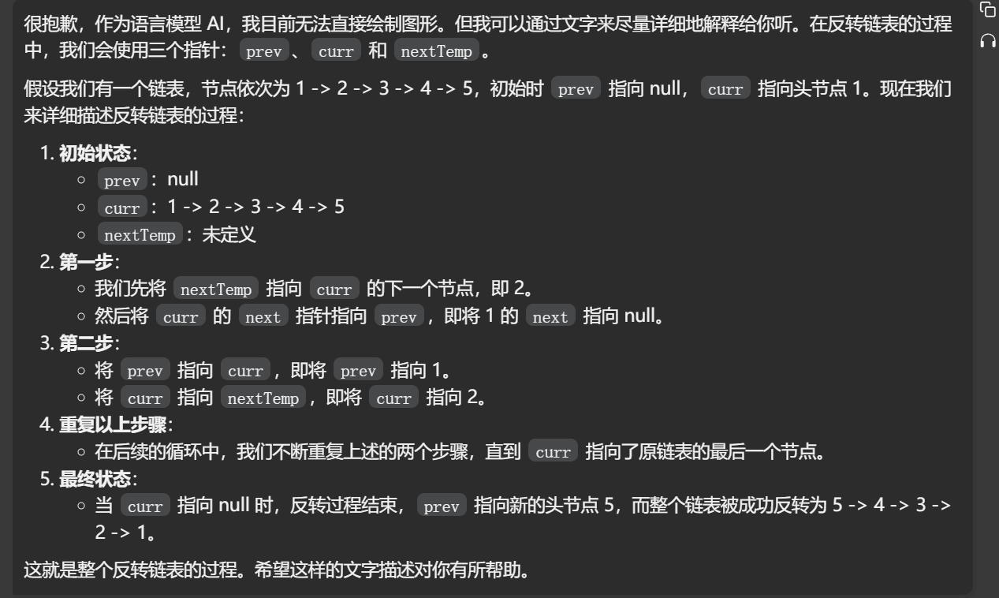

## 反转单链表

[反转链表_哔哩哔哩_bilibili](https://www.bilibili.com/video/BV1sd4y1x7KN/?vd_source=96c1635797a0d7626fb60e973a29da38)


// 反转单链表测试链接 : https://leetcode.cn/problems/reverse-linked-list/

## 左神

```
// 单链表节点
public static class ListNode {
    public int val;
    public ListNode next;

    public ListNode(int val) {
       this.val = val;
    }

    public ListNode(int val, ListNode next) {
       this.val = val;
       this.next = next;
    }
}
```

```java


class Solution {

    public static ListNode reverseList(ListNode head) {
       ListNode pre = null;
       ListNode next = null;
       while (head != null) {
          next = head.next;
          head.next = pre;
          pre = head;  //让pre跟head指向一样的位置
          head = next;
       }
       return pre;
    }

}
```


## gpt

```java
public class Solution {
    public ListNode reverseList(ListNode head) {
        ListNode prev = null; // 用于记录前一个节点
        ListNode curr = head; // 当前节点从头节点开始
        ListNode nextTemp; // 暂存下一个节点
        while (curr != null) {
            nextTemp = curr.next; // 暂存下一个节点
            curr.next = prev; // 当前节点指向前一个节点，完成反转
            prev = curr; // prev 指针向后移动
            curr = nextTemp; // curr 指针向后移动
        }
        return prev; // 最后 prev 指向新的头节点
    }
}
 

```




## 反转双链表

```

public static class ListNode {
    public int val;
    public ListNode next;

    public ListNode(int val) {
       this.val = val;
    }

    public ListNode(int val, ListNode next) {
       this.val = val;
       this.next = next;
    }
}
```

```
public static DoubleListNode reverseDoubleList(DoubleListNode head) {
    DoubleListNode pre = null;
    DoubleListNode next = null;
    while (head != null) {
       next = head.next;
       head.next = pre;
       head.last = next;
       pre = head;
       head = next;
    }
    return pre;
}
```

这个方法是用来反转一个双向链表的。在双向链表中，每个节点都有两个指针：一个指向前一个节点（`last`），一个指向后一个节点（`next`）。反转双向链表的目标是让每个节点的`next`指针指向它之前的节点，而`last`指针指向它之后的节点。

下面我将逐步解释这个方法的每一部分：

1. `DoubleListNode pre = null;` 初始化一个名为`pre`的变量来存储当前节点的前一个节点。初始时没有前一个节点，所以设置为`null`。
2. `DoubleListNode next = null;` 初始化一个名为`next`的变量来存储当前节点的下一个节点。初始时设置为`null`。
3. `while (head != null) {` 开始一个循环，该循环会遍历链表直到当前节点`head`为`null`，即到达链表的尾部。
4. `next = head.next;` 在更改当前节点的`next`指针之前，先将当前节点的下一个节点存储在`next`变量中。
5. `head.next = pre;` 将当前节点的`next`指针指向`pre`，也就是它之前的节点。在第一次迭代时，`pre`是`null`，因为我们正在处理链表的第一个节点。
6. `head.last = next;` 将当前节点的`last`指针指向`next`，也就是它之后的节点。这一步在原始链表中是不必要的，因为`last`本来就指向`next`。但是，在反转链表时，我们需要更新`last`指针以指向新的“前一个”节点。
7. `pre = head;` 移动`pre`指针到当前节点，因为在下一次迭代中，当前节点将成为下一个节点的前一个节点。
8. `head = next;` 移动`head`指针到下一个节点，继续进行反转操作。
9. `}` 结束循环。
10. `return pre;` 当`head`变为`null`时，循环结束。此时，`pre`指向原链表的最后一个节点，也就是反转后链表的第一个节点。返回`pre`作为新链表的头节点。

注意，第6步中的`head.last = next;`似乎有点迷惑人。实际上，这里的`next`变量在这个时候存储的是反转之前的下一个节点，也就是反转后的上一个节点。所以，这一步实际上是在正确地更新`last`指针。


假设我们有一个简单的双向链表，它包含三个节点 A、B 和 C：

```
null <- A <-> B <-> C -> null
 
```

每个节点都有两个指针：`last` 指向前一个节点，`next` 指向下一个节点。链表的头节点 A 的 `last` 指针是 `null`，尾节点 C 的 `next` 指针是 `null`。

现在我们使用上述方法来反转这个链表。我们将使用三个指针：`head`（当前节点），`pre`（前一个节点），`next`（下一个节点）。

1. 初始状态：

```
pre = null
head = A
next = null

null <- A <-> B <-> C -> null
 
```

1. 第一次迭代：

- 保存下一个节点：`next = head.next` -> `next = B`
- 反转指针：`head.next = pre` -> A 的 `next` 现在指向 `null`
- 反转指针：`head.last = next` -> A 的 `last` 现在指向 B
- 移动 `pre` 和 `head`：`pre = A`, `head = B`

```
pre = A
head = B
next = B

A <- null  B <-> C -> null
  -> 
 
```

1. 第二次迭代：

- 保存下一个节点：`next = head.next` -> `next = C`
- 反转指针：`head.next = pre` -> B 的 `next` 现在指向 A
- 反转指针：`head.last = next` -> B 的 `last` 现在指向 C
- 移动 `pre` 和 `head`：`pre = B`, `head = C`

```
pre = B
head = C
next = C

null <- A <- B  C -> null
           -> 
 
```

1. 第三次迭代：

- 保存下一个节点：`next = head.next` -> `next = null`
- 反转指针：`head.next = pre` -> C 的 `next` 现在指向 B
- 反转指针：`head.last = next` -> C 的 `last` 现在指向 `null`
- 移动 `pre` 和 `head`：`pre = C`, `head = null`

```
pre = C
head = null
next = null

null <- A <- B <- C -> null
 
```

1. 结束迭代，返回 `pre` 作为新链表的头节点。

最终结果是反转后的链表：

```
null <- C <-> B <-> A -> null
 
```

现在，每个节点的 `next` 和 `last` 指针都指向了正确的方向，实现了链表的反转。希望这个文字描述能帮助您更好地理解双向链表反转的过程。如果您有任何疑问，或者需要进一步的解释，请随时告诉我。