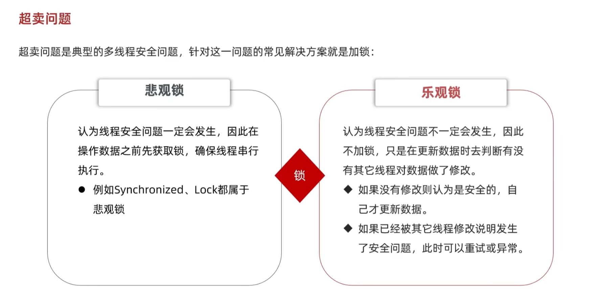
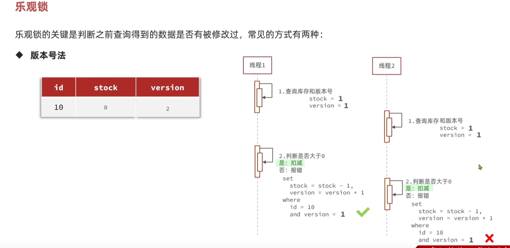

# 扣除库存

## 我的错误写法

```java
voucher.setStock(voucher.getStock()-1);
```

**为什么 `voucher.setStock(voucher.getStock() - 1)` 不行？**

1. **只是更新 Java 对象中的字段**：
   - `voucher.setStock(voucher.getStock() - 1)` 只是对 `voucher` 这个对象在 **内存** 中的 `stock` 字段进行了修改，它并没有立即更新数据库中的记录。
   - 这种做法只改变了当前 JVM 中的对象状态，而 **数据库中的库存数据并没有更新**，你还需要执行额外的数据库更新操作才能将这个更改持久化到数据库中。


## 正确写法

```java
boolean success = seckillVoucherService.update()
        .setSql("stock = stock-1")       // 设置 SQL 片段，执行 stock 字段减 1 操作
        .eq("voucher_id", voucherId)     // 添加查询条件，voucher_id = voucherId
        .update();                       // 执行更新操作

```

- ### 1. **`seckillVoucherService.update()`**

  - `seckillVoucherService` 是你代码中的服务类，负责操作秒杀券相关的数据。
  - `update()` 方法是 MyBatis-Plus 提供的更新操作的起点。它返回一个 `UpdateWrapper` 对象，可以继续链式调用方法来构建更复杂的更新操作。

  ### 2. **`.setSql("stock = stock - 1")`**

  - `setSql` 是 MyBatis-Plus 提供的一种方法，用于设置 **SQL 片段**。在这里，它用于更新数据库中的 `stock` 字段，执行 `stock = stock - 1` 操作，即将库存减少 1。
  - 这相当于在 SQL 中执行 `SET stock = stock - 1`，表示将 `stock` 字段的值减去 1。

  ### 3. **`.eq("voucher_id", voucherId)`**

  - `eq` 是 MyBatis-Plus 提供的条件构造方法，表示 **等于** 条件。在这里，`voucher_id = voucherId` 用于指定更新操作的条件：即更新 `voucher_id` 为 `voucherId` 的记录。
  - 这相当于 SQL 中的 `WHERE voucher_id = ?` 条件，用来定位需要更新的记录。

  ### 4. **`.update()`**

  - `update()` 方法是 MyBatis-Plus 提供的执行更新操作的方法。调用这个方法时，实际执行的 SQL 会根据前面设置的条件来进行更新。

  - 这将生成并执行类似于以下的 SQL 语句：

    ```sql
    UPDATE seckill_voucher
    SET stock = stock - 1
    WHERE voucher_id = ?
    ```

  ### 5. **`boolean success = ...`**

  - 这部分代码的 `success` 变量用于接收更新操作的结果。`update()` 方法会返回一个 `boolean` 类型的值，表示更新是否成功。
  - 如果数据库更新成功，`success` 会是 `true`；如果没有记录被更新（例如 `voucher_id` 不存在），`success` 会是 `false`。

  ### 6. **总结**

  - 这行代码的目的是通过 `seckillVoucherService` 服务来更新秒杀券的库存，具体做法是减少 `stock` 字段的值。通过 `voucher_id` 来定位要更新的秒杀券记录。`stock = stock - 1` 语句用于减少库存。
  - 最终，它返回一个 `boolean` 值，表示操作是否成功。


# 超卖问题

## 乐观锁与悲观锁






### **示例说明：**

#### 初始状态：数据库中的库存为 `1`。

1. **线程A执行：**

   - 查询数据库库存，`voucher.getStock() = 1`（存储在内存中）。

   - 执行 update 语句：

     ```
     UPDATE seckill_voucher 
     SET stock = stock - 1 
     WHERE voucher_id = ? AND stock = 1;
     ```

   - 更新成功，数据库库存变成 `0`。

2. **线程B执行（几乎同时）：**

   - 也查询数据库库存，`voucher.getStock() = 1`（存储在内存中，已过期）。

   - 执行相同的 update 语句：

     ```sql
     UPDATE seckill_voucher 
     SET stock = stock - 1 
     WHERE voucher_id = ? AND stock = 1;
     ```

   - 数据库中的 `stock` 已经变成 `0`，不满足条件，更新失败，防止超卖。